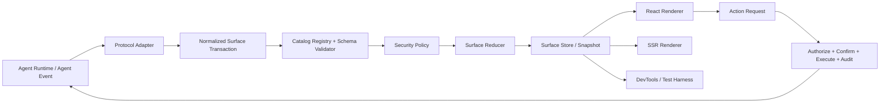
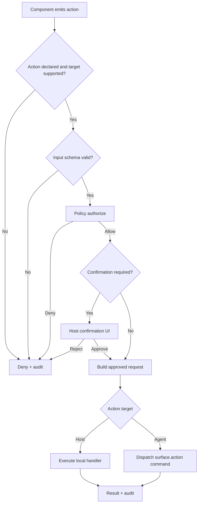
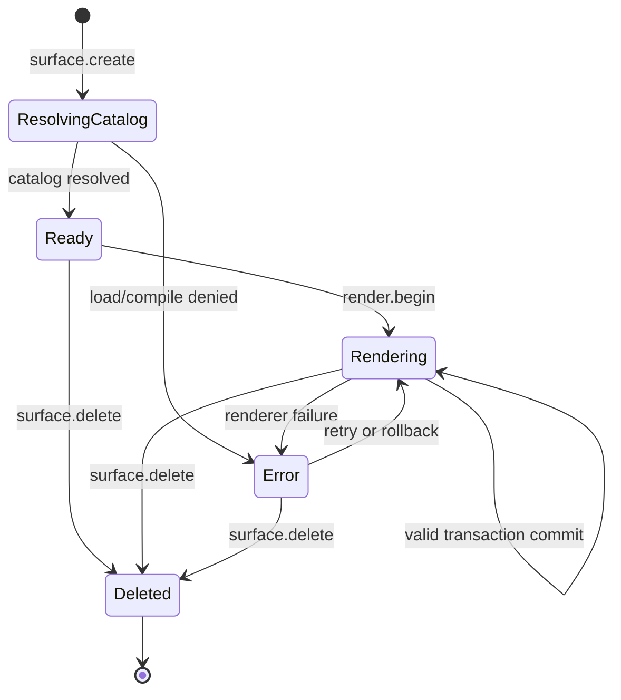

# 第三阶段系分：生产级生成式 UI

> 状态：Draft 规划阶段：2027-01 至 2027-03 目标模块：`@ant-design/x-card`、`@ant-design/x-sdk`、`@ant-design/x` 参与工作流：Generative UI、Runtime、Interaction、Quality最后更新：2026-08-04

## 1. 结论摘要

第三阶段不在现有 `Card.tsx` 上继续叠加能力，而是引入框架无关的 Surface Runtime，并将当前 `XCard.Box` / `XCard.Card` 改造成兼容适配层和 React 渲染层。

本系分作出以下核心决策：

1. A2UI v0.8 和 v0.9 先归一化为内部命令，再进入同一套事务、校验、Reducer 和渲染流程。
2. Catalog 从模块级全局缓存升级为可注入的 `CatalogRegistry`，支持本地注册、受控远程加载、版本协商、缓存和完整性校验。
3. 未声明 Catalog、Catalog 未注册组件、Schema 不合法属性和未注册 Action 在 GA 版本中默认拒绝。
4. Action 只表达意图，不直接执行代码。所有 Action 必须经过参数校验、权限决策、危险操作确认、执行和审计五段式管线；本地 Action 进入宿主 handler，Agent Action 复用 SDK 的 Agent Command 通道。
5. Surface 更新采用草稿校验后原子提交，失败时保留上一稳定版本；React 渲染异常由 Surface 级错误边界隔离并支持回滚。
6. `@ant-design/x-sdk` Agent Event Model 升级到可识别 Surface 生命周期的协议版本，`x-card` 负责消费 A2UI 内容，SDK 不依赖 React 或 `x-card`。
7. Surface 是 Artifact 的可交互投影。Artifact 负责生成物身份和生命周期，Surface 负责界面协议、渲染状态和交互，不复制保存两份组件树。
8. SSR 使用实例级 Runtime、Catalog 预加载和可序列化 Snapshot；流式水合按事件游标续播，客户端不重放服务端已经消费的命令。

目标版本建议为 `@ant-design/x-card` 3.x。现有 2.x API 保留一条兼容路径，但生产能力只在新 Runtime 上实现。

## 2. 背景与现状

路线图第三阶段要求完成：

- A2UI Catalog 本地注册、远程加载、缓存和版本协商。
- JSON Schema 校验、组件白名单和属性约束。
- Action 权限分级、危险操作确认和审计钩子。
- Surface 生命周期、局部更新、错误边界和回滚。
- 动态表单校验、跨卡片数据绑定和多 Surface 协作。
- SSR、流式水合和大型 Surface 性能优化。
- Catalog 测试工具、调试面板和可视化事件检查器。
- 与统一 Agent Event Model 和 Artifact 系统打通。

### 2.1 当前代码基线

| 位置 | 当前实现 | 生产化缺口 |
| --- | --- | --- |
| `packages/x-card/src/A2UI/catalog.ts` | 模块级 `Map`、本地注册、直接 `fetch` 远程 Catalog、必填字段检查 | 实例隔离、并发去重、TTL/ETag、来源限制、版本协商、完整 Schema 校验均缺失 |
| `packages/x-card/src/A2UI/Box.tsx` | React Effect 扫描新增命令并加载 Catalog | Catalog 加载失败只打印日志，无 Surface 状态、重试或错误边界 |
| `packages/x-card/src/A2UI/Card.tsx` | 每个 Card 自持组件树和 dataModel，Effect 重放该 Surface 的完整命令数组 | 命令增长后接近 O(n²)，没有事件幂等、事务、Snapshot 和回滚 |
| `packages/x-card/src/A2UI/utils.ts` | 未提供 Catalog 时默认通过；属性错误只返回字符串 | 不符合“未注册默认拒绝”，也无法覆盖类型、范围、组合 Schema 和数据格式 |
| `packages/x-card/src/A2UI/types` | v0.8/v0.9 两套命令在 React 层分支处理 | 协议差异侵入渲染层，后续版本难以独立演进 |
| `packages/x-sdk/src/agent` | 已有事件 Envelope、Reducer、Store、Provider | 当前协议 0.1 没有 Surface 生命周期和 Surface 状态 |
| `packages/x-sdk/src/agent/command` | 阶段二正在引入出站 Command、幂等键、能力声明和执行状态 | 尚无 `surface.action`，第三阶段需扩展而不是另建出站协议 |

### 2.2 必须解决的根问题

- 安全决策发生在渲染之后，非法组件目前仍可能进入组件解析流程。
- Catalog 是进程级共享状态，SSR 多请求和多租户场景可能相互污染。
- React 状态既承担协议消费又承担渲染，无法在不挂载 DOM 时重放、测试、SSR 或恢复。
- v0.8/v0.9 分支散落在 Card 内部，协议兼容成本随功能线性放大。
- 完整命令数组由外部维护，Card 在每次变更时重新过滤和处理历史命令。
- Action 只有 `onAction` 回调，没有身份、权限、风险、确认、执行结果和审计语义。
- Artifact 与 Surface 没有统一身份关联，Agent 时间线无法解释动态界面从何而来、当前处于什么版本。

## 3. 目标与非目标

### 3.1 目标

- 让不可信 Agent 输出只能在应用明确允许的 Catalog、组件、属性和 Action 边界内运行。
- 让 1,000 节点 Surface 的首次渲染、局部更新和交互具备可量化的性能门禁。
- 让同一事件流可在浏览器、SSR、测试和调试器中确定性重放。
- 让 v0.8/v0.9 兼容逻辑集中在 Adapter，核心 Runtime 和 React Renderer 不感知协议差异。
- 让 Surface 能被 Agent Event、Artifact 和应用状态可靠关联、恢复和审计。

### 3.2 非目标

- 不执行 Agent 生成的 HTML、JavaScript、React 组件代码或远程模块。
- 不把 `x-card` 建设成服务端 Agent 编排器或通用权限中心。
- 不在第三阶段实现 Vue Renderer，但 Runtime 不依赖 React。
- 不自动同步任意 Surface 的私有 dataModel，跨 Surface 共享必须显式声明。
- 不承诺把 A2UI 未来所有版本一次性抽象完，只建立可插拔 Adapter 边界。

## 4. 总体架构



处理顺序固定为：

```text
decode -> normalize -> structural validate -> catalog validate
       -> policy evaluate -> draft reduce -> invariant validate
       -> atomic commit -> notify renderer/devtools
```

任何步骤失败都不得修改已提交的 Surface Snapshot。

## 5. 模块边界

建议按以下目录演进，先保留在 `@ant-design/x-card` 内，避免第三阶段立即增加新包的发布和采用成本：

```text
packages/x-card/src/
  runtime/
    protocol/
    reducer/
    store/
    snapshot/
    data/
  adapters/
    a2ui-v0.8/
    a2ui-v0.9/
    agent-event/
  catalog/
    registry/
    loader/
    negotiation/
    validator/
  security/
    policy/
    action/
    audit/
  react/
    Provider.tsx
    Surface.tsx
    SurfaceErrorBoundary.tsx
  devtools/
  testing/
  A2UI/                  # 2.x 兼容入口，内部转发到新 Runtime
```

| 模块 | 职责 | 禁止承担的职责 |
| --- | --- | --- |
| Adapter | 解析具体协议并生成归一化事务 | React 渲染、远程请求、权限判断 |
| Catalog Registry | Catalog 发现、加载、协商、缓存和编译 | 执行 Action、持有 Surface 状态 |
| Surface Runtime | 生命周期、事务、图结构、dataModel、Snapshot | UI 样式、网络传输、业务权限来源 |
| Security | 合并应用策略和 Catalog 声明，输出决策 | 直接修改 Surface 或执行未注册代码 |
| React Renderer | 订阅 Snapshot 并渲染已批准节点 | 解析原始 A2UI 命令 |
| SDK Bridge | Agent Event 与 Surface 事务互转 | 依赖 `x-card` 的 React 类型 |

如果后续 Vue 或非 DOM 消费方达到两个以上，再将 `runtime` 抽取为独立包；第三阶段不提前拆包。

## 6. 核心领域模型

### 6.1 Runtime API

```ts
export interface SurfaceRuntimeOptions {
  catalogs: CatalogRegistry;
  adapters: readonly SurfaceProtocolAdapter[];
  policy?: SurfaceSecurityPolicy;
  limits?: Partial<SurfaceLimits>;
  sharedData?: Record<string, unknown>;
  onIssue?: (issue: SurfaceIssue) => void;
  onAudit?: (event: SurfaceAuditEvent) => void;
}

export interface SurfaceRuntime {
  dispatch(input: SurfaceInput): Promise<SurfaceDispatchResult>;
  dispatchBatch(inputs: readonly SurfaceInput[]): Promise<SurfaceDispatchResult>;
  getSnapshot(): SurfaceRuntimeSnapshot;
  getSurface(surfaceId: string): SurfaceSnapshot | undefined;
  subscribe(listener: () => void): () => void;
  rollback(surfaceId: string, revision?: number): SurfaceDispatchResult;
  dehydrate(): DehydratedSurfaceRuntime;
  dispose(): void;
}

export interface SurfaceInput {
  protocol: string;
  version: string;
  payload: unknown;
  eventId?: string;
  sequence?: number;
}

export interface SurfaceProtocolAdapter {
  protocol: string;
  versions: readonly string[];
  normalize(input: SurfaceInput): SurfaceTransaction | readonly SurfaceTransaction[];
}
```

公开 `dispatch` 使用异步语义，因为首次创建可能需要加载和编译 Catalog；纯 Reducer 仍保持同步。`dispatchBatch` 是跨 Surface 原子协作的基础，批次中任意操作失败时，整个批次不提交。

### 6.2 Surface 状态

```ts
export type SurfaceStatus = 'resolving-catalog' | 'ready' | 'rendering' | 'error' | 'deleted';

export interface SurfaceSnapshot {
  id: string;
  status: SurfaceStatus;
  protocol: { name: 'a2ui'; version: '0.8' | '0.9' | (string & {}) };
  catalog: ResolvedCatalogRef;
  revision: number;
  rootId?: string;
  nodes: ReadonlyMap<string, SurfaceNode>;
  dataModel: Readonly<Record<string, unknown>>;
  lastStableRevision?: number;
  issue?: SurfaceIssue;
  artifactId?: string;
}
```

Runtime 内部保持 Map 以实现按节点更新；`dehydrate()` 输出普通对象和数组，禁止把函数、React Component、AbortController 等不可序列化值写入 Snapshot。

### 6.3 归一化事务

```ts
export interface SurfaceTransaction {
  transactionId: string;
  surfaceId: string;
  expectedRevision?: number;
  source: {
    protocol: string;
    version: string;
    eventId?: string;
    sequence?: number;
  };
  operations: readonly SurfaceOperation[];
}

export type SurfaceOperation =
  | { type: 'surface.create'; catalog: CatalogRequest; artifactId?: string }
  | { type: 'node.upsert'; nodes: readonly SurfaceNodeInput[] }
  | { type: 'node.remove'; nodeIds: readonly string[] }
  | { type: 'data.set'; scope: 'surface' | 'shared'; path: string; value: unknown }
  | { type: 'render.begin'; rootId: string }
  | { type: 'surface.delete'; reason?: string };
```

约束：

- `transactionId` 和 Agent Event `eventId` 用于幂等去重。
- `expectedRevision` 用于拒绝过期更新，拒绝后由上层恢复或重放。
- v0.9 `updateComponents` 归一化为 `node.upsert`；不可达节点在事务提交后按策略回收。
- v0.8 `beginRendering` 归一化为显式 `render.begin`，不再把协议状态放进 React Ref。
- 图必须存在唯一可达根节点，不允许环、悬空引用或超出深度/节点限制。

## 7. Catalog 设计

### 7.1 Catalog 描述

```ts
export interface CatalogManifest {
  id: string;
  version: string;
  supportedProtocols: readonly string[];
  components: Readonly<Record<string, CatalogComponentSchema>>;
  actions?: Readonly<Record<string, CatalogActionSchema>>;
  dataSchema?: JsonSchema;
  integrity?: string;
}

export interface CatalogRequest {
  id: string;
  version?: string;
  versionRange?: string;
  integrity?: string;
}
```

Catalog Registry 中只保存声明，不保存远程可执行组件或 React 类型。组件实现由 React 层的本地 Component Registry 注册：

```ts
catalogs.register(manifest);
const components = createComponentRegistry({ Button, Form, Input });
```

只有同时满足以下条件的节点才可渲染：

1. 组件名存在于协商后的 Catalog。
2. 宿主注册了该组件实现。
3. 原始属性通过 Catalog Schema。
4. 数据绑定解析后的属性通过可选运行时 Schema。
5. Security Policy 未拒绝该组件或属性。

### 7.2 加载和缓存

```ts
export interface CatalogLoader {
  load(request: CatalogRequest, context: CatalogLoadContext): Promise<CatalogLoadResult>;
}

export interface CatalogLoadContext {
  signal: AbortSignal;
  allowedOrigins: readonly string[];
  credentials: 'omit' | 'same-origin';
}
```

默认行为：

- 本地 Catalog 优先，生产模式缺失时直接失败，不返回空 Catalog。
- 远程加载必须配置允许的 Origin；默认只允许同源且 `credentials: 'omit'`。
- 拒绝 `file:`、`data:`、`javascript:` 以及重定向到非允许 Origin 的地址。
- 单个 Catalog 默认上限 1 MiB，默认超时 5 秒。
- 相同 `id + version + integrity` 的并发请求共享同一 Promise。
- 缓存键包含最终版本和完整性摘要，支持 ETag、TTL、LRU 和显式失效。
- SSR Registry 为请求级实例；应用可注入只读的进程级编译缓存，但不得保存租户凭据。

### 7.3 版本协商

协商输入包括宿主支持版本、Agent 请求范围、协议版本和完整性约束。选择规则为：

1. 过滤 Catalog `id` 不匹配的候选。
2. 过滤不支持当前 A2UI 协议的候选。
3. 计算宿主版本范围与 Agent 版本范围交集。
4. 在交集中选择宿主已注册的最高稳定版本。
5. 如果指定完整性摘要，摘要不一致立即拒绝且不降级。
6. 无交集时返回 `catalog_version_mismatch`，不静默选择相邻版本。

协商结果写入 Surface Snapshot 和审计事件，保证恢复时能锁定相同版本。

### 7.4 Schema 校验

采用 JSON Schema 2020-12 和 Ajv 编译校验器。编译发生在 Catalog 注册/加载阶段，不在每个节点渲染时重复编译。

校验分四层：

| 层级 | 校验内容 | 失败策略 |
| --- | --- | --- |
| Envelope | 命令类型、版本、Surface ID、载荷结构 | 拒绝整条输入 |
| Graph | 根节点、引用、环、深度、节点数、唯一 ID | 拒绝整个事务 |
| Catalog | 组件白名单、属性类型、必填、枚举、范围、`additionalProperties` | 拒绝非法节点，默认导致事务失败 |
| Data | dataModel Schema、表单字段、绑定解析值 | 拒绝数据事务并保留原值 |

安全配置：

- 禁止运行时从任意 URL 自动加载 `$ref`，仅允许 Catalog 内 `$defs` 和宿主预注册 Schema。
- 校验错误使用 JSON Pointer 标识路径，不在错误信息中输出完整敏感值。
- Path Binding 必须使用 Catalog 提供的 `Bindable<T>` Schema，不能以 `{ path }` 绕过属性类型约束。

## 8. Action 安全管线

### 8.1 Action 声明和宿主注册

```ts
export type ActionRisk = 'low' | 'medium' | 'high' | 'critical';

export interface CatalogActionSchema {
  input: JsonSchema;
  risk: ActionRisk;
  sideEffect: 'none' | 'local' | 'remote' | 'destructive';
  target: 'host' | 'agent';
  permission?: string;
}

export interface ActionHandlerRegistration {
  name: string;
  inputSchema?: JsonSchema;
  minimumRisk?: ActionRisk;
  execute(request: ApprovedActionRequest): Promise<unknown> | unknown;
}
```

最终风险取 Catalog 声明、宿主注册和应用策略三者中的最高等级。Agent 不能通过把 `risk` 写成 `low` 来降低宿主定义的风险。

### 8.2 决策流程



默认策略：

| 风险     | 默认决策                                                                       |
| -------- | ------------------------------------------------------------------------------ |
| low      | 仅在宿主已注册 handler 或 Provider 声明对应 Command 能力，且 Schema 通过时允许 |
| medium   | 需要应用策略显式允许                                                           |
| high     | 需要应用策略允许并由用户确认                                                   |
| critical | 默认拒绝；应用必须同时显式允许、提供确认器和审计接收器                         |

确认 UI 复用阶段二 `Approval` 组件，不在 `x-card` 内复制视觉和交互规范。由客户端策略触发的确认只产生本地决策，确认通过后才进入本地 handler 或发送 `surface.action`；由 Agent `approval.requested` 触发的确认才通过现有 `approval.resolve` Agent Command 提交。确认文本、目标对象和最终参数必须在确认时可见，执行前再次校验确认后的参数。

`target: 'host'` 只调用本地注册的 Action Handler；`target: 'agent'` 在授权和确认后生成 `surface.action` Agent Command。两条路径共用同一个策略和审计模型，且都禁止 Catalog 携带可执行实现。

### 8.3 审计

每次 Action 至少发出以下审计节点：

```text
action.requested
action.denied | action.confirmation_requested
action.confirmed | action.rejected
action.started
action.completed | action.failed
```

审计记录包含 action 名、Surface/Artifact/Session/Run 身份、Catalog 版本、风险、决策原因、耗时和结果状态。参数默认只记录字段名和摘要，敏感字段由 Catalog `writeOnly`、宿主脱敏器和应用策略共同处理。

审计 Hook 只接收结构化事件，不负责持久化；持久化和合规留存由应用接入。

## 9. Surface 生命周期、局部更新和回滚



事务提交规则：

1. 从当前 Snapshot 创建结构共享的 Draft。
2. 在 Draft 上应用全部 operations。
3. 执行 Schema、图不变量、绑定和权限校验。
4. 全部通过后 revision 加一并原子替换 Snapshot。
5. 保存最近三个稳定 revision 的轻量 Snapshot，数量可配置。
6. 任一步失败时丢弃 Draft，返回结构化 `SurfaceIssue`，当前 UI 不闪烁、不清空。

React Error Boundary 只隔离渲染异常，不吞掉协议错误。发生异常时展示应用传入的 `fallback`，并提供：

- 重试当前 revision。
- 回滚到 `lastStableRevision`。
- 删除 Surface。
- 通过 `onIssue` 上报错误。

局部更新必须保持节点引用稳定。只订阅 dataModel 的组件在其他节点更新时不重新渲染；选择器以 `surfaceId + nodeId + binding paths` 为粒度。

## 10. 数据、表单和多 Surface 协作

### 10.1 数据域

Runtime 提供两个明确数据域：

- `surface`：每个 Surface 私有，Surface 删除时释放。
- `shared`：Box/Runtime 实例内共享，由宿主初始化和持久化。

绑定格式扩展为：

```ts
type DataBinding = {
  path: string;
  scope?: 'surface' | 'shared'; // 默认 surface
  mode?: 'read' | 'write' | 'readwrite';
};
```

禁止通过 Surface ID 直接读取另一个 Surface 的私有 dataModel。跨卡片同步必须写入 `shared` 域，并由 Catalog Schema 声明可读写路径。这样可以避免隐式循环依赖和 Surface 删除后的悬空引用。

### 10.2 动态表单

- Catalog 可提供 `dataSchema`，表单字段绑定到 dataModel JSON Pointer。
- 字段级校验在输入和失焦时执行，提交前执行整个 `dataSchema` 校验。
- 校验状态属于本地 UI State，不写回 Agent 生成的数据；校验结果通过明确 Action Context 上报。
- Agent 更新正在编辑的字段时，默认保留用户脏值并产生冲突状态；宿主可配置 `agent-wins`、`user-wins` 或自定义合并。
- 提交 Action 只有在当前 revision、数据 Schema 和 Action input Schema 同时通过后才能进入权限管线。

### 10.3 多 Surface 原子更新

`dispatchBatch` 可在一个事务中更新多个 Surface 和 shared data。典型流程为：

```text
更新 shared/order -> 更新 checkout Surface -> 创建 result Surface -> 删除 cart Surface
```

任一 Catalog、Schema 或权限校验失败时，四步全部不提交。批次提交后各 Surface 独立通知订阅者，React 侧使用批处理避免中间态渲染。

## 11. Agent Event 和 Artifact 集成

### 11.1 Agent Event Model

现有协议 0.1 的 validator 会拒绝未知事件类型，因此新增 Surface 事件需要协议版本协商，不能只向 Union 添加类型。建议新增 0.2：

```ts
interface SurfaceAgentEventPayloadMap {
  'surface.created': {
    surfaceId: string;
    artifactId?: string;
    mediaType: 'application/vnd.a2ui+json' | (string & {});
    protocolVersion: string;
    catalog: CatalogRequest;
  };
  'surface.updated': {
    surfaceId: string;
    revision?: number;
    delta: unknown;
  };
  'surface.deleted': {
    surfaceId: string;
    reason?: string;
  };
}
```

设计约束：

- `x-sdk` 只校验通用 Envelope 和 Surface 身份，不解释 A2UI `delta`。
- `x-card/adapters/agent-event` 根据 `mediaType + protocolVersion` 解析 `delta`。
- SDK Reducer 保存 Surface 元数据、revision、状态和 Artifact 关联，不保存完整节点图。
- 协议解码器在迁移期同时接受 0.1/0.2；Provider 在启动时声明支持的版本，不能依赖当前的单一字符串常量。
- 0.1 客户端收到 0.2 时明确报 `unsupported_protocol_version`，不把 Surface 当普通消息吞掉。

### 11.2 Artifact 关系

Surface 是 Artifact 的交互视图，两者通过 `artifactId` 关联：

- `artifact.created` 建立生成物身份、名称、mediaType 和生命周期。
- `surface.created` 为 Artifact 建立可交互投影，可晚于 Artifact 创建。
- 一个 Artifact 可以有多个 Surface，例如编辑视图和预览视图。
- Surface 删除不等于 Artifact 删除；Artifact 完成也不强制删除 Surface。
- Artifact 容器根据 mediaType 选择 `XCard.Surface` Renderer，未知 mediaType 使用现有自定义 Artifact Renderer。

阶段二 Artifact API 未稳定前，第三阶段先使用可选 `artifactId`，集成代码不得反向侵入 Runtime 核心。

### 11.3 Agent Command 集成

阶段二已经建立出站 Agent Command Envelope、`idempotencyKey`、Provider `capabilities.commands`、按 Run 串行执行和 Command 状态。Surface 的 Agent Action 必须扩展这条通道：

```ts
interface SurfaceAgentCommandPayloadMap {
  'surface.action': {
    surfaceId: string;
    artifactId?: string;
    action: string;
    context?: unknown;
    surfaceRevision: number;
    catalog: { id: string; version: string };
  };
}
```

约束：

- 新类型会被 0.1 Command validator 拒绝，因此需要 Agent Command 0.2 或在协议层建立明确的扩展类型协商，不能只修改 TypeScript Union。
- `surface.action` 复用 `commandId`、`idempotencyKey`、Session/Run 身份、Provider 能力声明和串行执行。
- `surfaceRevision` 用于阻止用户基于过期界面提交；Provider 返回 revision 冲突时，应用先恢复 Surface 再允许重试。
- Command 发出前 Action Policy 必须已经批准；Provider 仍需做服务端授权，前端授权不是安全边界的终点。
- Command 产生的后续 `surface.updated`、`approval.requested`、`artifact.updated` 等 Agent Event 继续进入统一 Store，不直接回调修改 React 状态。

## 12. React API 与兼容层

建议的新 API：

```tsx
const runtime = createSurfaceRuntime({
  catalogs,
  policy,
  onAudit,
  onIssue,
});

<XCard.Provider runtime={runtime} components={components}>
  <XCard.Surface id="booking" fallback={({ issue, retry, rollback }) => null} />
</XCard.Provider>;
```

保留兼容用法：

```tsx
<XCard.Box commands={commands} components={components} onAction={onAction}>
  <XCard.Card id="booking" />
</XCard.Box>
```

兼容层内部创建 Runtime，并通过命令数组游标只消费新增命令。检测到数组替换或回退时重建 Runtime，而不是在每个 Card 内重放历史。兼容层不得绕过 GA 的安全默认值。

已有 API 处理：

| 2.x API             | 3.x 处理                                                             |
| ------------------- | -------------------------------------------------------------------- |
| `registerCatalog`   | 保留，注册到默认浏览器 Registry；SSR 和多租户提示改用实例 Registry   |
| `loadCatalog`       | 保留为兼容入口；生产远程加载要求显式配置 Origin 策略                 |
| `clearCatalogCache` | 标记 deprecated，替换为 `registry.clear()` / `registry.invalidate()` |
| `validateComponent` | 标记 deprecated，替换为编译后的 `registry.validateNode()`            |
| `XCard.Box/Card`    | 保留至少一个大版本，内部转发 Runtime                                 |
| `commands`          | 保留；新增流式 `runtime.dispatch()`，推荐迁移                        |

## 13. SSR 与流式水合

SSR 流程：

1. 每个请求创建独立 Catalog Registry 和 Surface Runtime。
2. 根据首批 Agent Event 预加载并编译 Catalog。
3. 服务端 dispatch 事件，得到确定性 Snapshot。
4. React 使用 `useSyncExternalStore` 的 `getServerSnapshot` 渲染。
5. `dehydrate()` 输出 Snapshot、已消费事件游标、Catalog ID/版本/完整性和校验器缓存键。
6. 客户端校验 Snapshot 版本和摘要后 hydrate。
7. 水合完成前到达的增量事件进入队列，完成后从服务端游标的下一条开始提交。

必须保证：

- 相同 Snapshot 和组件注册表生成相同 DOM 结构和稳定 key。
- 服务器不执行 Action，不持久化浏览器确认结果。
- Snapshot 脚本采用安全 JSON 序列化，转义 `<`、U+2028、U+2029，避免脚本上下文注入。
- Catalog 未预加载时允许输出稳定 Skeleton；不得在服务端静默使用空 Catalog 渲染。
- Catalog 版本或完整性不匹配时放弃水合并受控重建该 Surface，不影响页面其他区域。

## 14. 错误模型

```ts
export interface SurfaceIssue {
  code:
    | 'unsupported_protocol'
    | 'invalid_command'
    | 'catalog_not_found'
    | 'catalog_version_mismatch'
    | 'catalog_integrity_mismatch'
    | 'schema_validation_failed'
    | 'component_not_allowed'
    | 'action_not_allowed'
    | 'revision_conflict'
    | 'graph_invariant_failed'
    | 'limit_exceeded'
    | 'render_failed';
  phase: 'decode' | 'catalog' | 'policy' | 'reduce' | 'render' | 'action';
  surfaceId?: string;
  transactionId?: string;
  path?: string;
  recoverable: boolean;
  message: string;
  cause?: unknown;
}
```

开发环境可以输出详细 cause；生产回调默认不包含组件 props、dataModel 和 Action 参数原文。

## 15. 安全和资源限制

默认限制建议：

| 项目                 |  默认值 |      可配置范围 |
| -------------------- | ------: | --------------: |
| 单 Surface 节点数    |   2,000 |    100 - 10,000 |
| 图最大深度           |      64 |         8 - 256 |
| 单事务 operations    |   2,500 |     10 - 20,000 |
| 单次 dataModel 更新  | 256 KiB |  16 KiB - 2 MiB |
| 单 Catalog 大小      |   1 MiB |  64 KiB - 5 MiB |
| Action Context       |  64 KiB | 4 KiB - 512 KiB |
| Catalog 加载超时     |    5 秒 |       1 - 30 秒 |
| 稳定 Snapshot 保留数 |       3 |          1 - 10 |

这些限制用于阻止内存和计算资源耗尽。达到限制时拒绝当前事务，不截断数据后继续渲染。

额外边界：

- 组件 props 不允许 `dangerouslySetInnerHTML`，除非宿主自定义组件自己处理且策略显式允许。
- Catalog 不能声明事件处理函数、URL import 或脚本表达式。
- URL、图片、下载和导航类属性由宿主 URL Policy 二次校验协议与域名。
- 键名 `__proto__`、`prototype`、`constructor` 在 JSON Pointer 和对象更新中拒绝，防止原型污染。
- 审计和调试器展示的数据先通过统一脱敏器。

## 16. 调试器与测试工具

### 16.1 DevTools

调试面板提供以下视图：

- Events：原始输入、归一化事务、revision、耗时和拒绝原因。
- Surface Tree：节点图、根节点、不可达节点和订阅关系。
- Data：surface/shared data、绑定路径和表单校验结果。
- Catalog：来源、版本、缓存命中、Schema 编译和组件注册状态。
- Security：Action 风险、权限决策、确认和审计链。
- Performance：decode、validate、reduce、React commit 和节点重渲染计数。

DevTools 通过 Runtime Observer API 订阅只读事件，生产构建可 tree-shake，不允许直接修改 Runtime 状态。

### 16.2 测试工具

```ts
const harness = createSurfaceTestHarness({ catalogs, policy });

await harness.dispatch(commands);
expect(harness.surface('booking')).toMatchSurfaceSnapshot();
expect(harness.issues()).toEqual([]);
expect(harness.audit()).toContainActionDecision('submit', 'allowed');
```

提供：

- `validateCatalog(manifest)`：离线结构和 Schema 编译检查。
- `createSurfaceTestHarness()`：无 React 的命令重放和断言。
- `toMatchSurfaceSnapshot()`：稳定序列化节点图和 dataModel。
- Action Policy 测试构造器。
- v0.8/v0.9 等价序列测试。
- 非法 Schema、循环图、重复事件、乱序 revision 和资源上限的属性/模糊测试。

## 17. 性能方案和门禁

### 17.1 性能原则

- 命令增量消费，不扫描完整历史数组。
- 节点 Map 结构共享，局部更新只替换受影响节点。
- Schema 在 Catalog 注册时编译，运行时复用 validator。
- dataModel 按绑定路径订阅，避免任何数据变化都重渲染整棵树。
- 大批量事务在可中断调度中分段验证，但只允许最终原子提交。
- DevTools 和审计序列化不进入生产热路径。

### 17.2 目标门禁

在固定 Playwright Chromium、4 倍 CPU 降速、无浏览器扩展的基准环境中：

| 场景 | 目标 |
| --- | --: |
| 1,000 节点 Catalog 已编译，normalize + validate + reduce，p95 | <= 50 ms |
| 1,000 节点首次 React commit，p95 | <= 500 ms |
| 20 节点局部更新端到端，p95 | <= 50 ms |
| 表单输入交互 INP，p75 | <= 200 ms |
| 单节点 dataModel 更新 | 不得导致无关节点重渲染 |
| 相同 1,000 节点命令连续追加 100 次 | 总处理量近似线性，不得出现完整历史重放 |

CI 同时保存绝对值和相对基线。绝对值用于验收，连续两个 PR 相对回退超过 10% 时阻断合并并人工复核。

## 18. A2UI v0.8/v0.9 迁移策略

### 18.1 归一化映射

| v0.8                          | v0.9                          | 内部 Operation   |
| ----------------------------- | ----------------------------- | ---------------- |
| 首次 `surfaceUpdate` 隐式创建 | `createSurface`               | `surface.create` |
| `surfaceUpdate.components`    | `updateComponents.components` | `node.upsert`    |
| `dataModelUpdate.contents`    | `updateDataModel.path/value`  | `data.set`       |
| `beginRendering.root`         | 首批组件到达后默认 root       | `render.begin`   |
| `deleteSurface`               | `deleteSurface`               | `surface.delete` |

### 18.2 支持周期

- 3.0 同时支持 v0.8/v0.9；v0.9 是生产功能基线。
- v0.8 进入维护模式，只修复安全和兼容问题，不增加跨 Surface、版本协商等新语义。
- 开发环境对 v0.8 输出一次性迁移提示，DevTools 可导出等价 v0.9 命令。
- v0.8 移除至少满足：提前两个 Minor 公告、提供自动迁移工具、官方示例完成迁移、稳定支持不少于六个月。
- 协议未知时拒绝，不猜测为 v0.8。

## 19. 交付拆分

### 2027-01：Runtime 和安全底座

- 冻结 Normalized Operation、Surface Snapshot 和 Issue 类型。
- 完成 v0.8/v0.9 Adapter、纯 Reducer、Store、幂等和 revision。
- 完成 Catalog Registry、远程 Loader、缓存、版本协商和 Ajv 校验。
- 建立组件/属性默认拒绝策略和资源限制。
- `XCard.Box/Card` 接入兼容 Runtime。
- 建立 1,000 节点基准和线性命令消费门禁。

退出条件：无 React 环境可重放两版 A2UI；非法 Catalog/组件/属性不会进入 Renderer；现有 Demo 通过兼容层运行。

### 2027-02：Action、数据和多 Surface

- 完成 Action Policy、风险分级、Approval 接入和审计 Hook。
- 完成 Surface 事务、稳定 Snapshot、回滚和 Error Boundary。
- 完成 dataSchema、动态表单校验、shared data 和冲突策略。
- 完成跨 Surface `dispatchBatch` 原子提交。
- 接入阶段二 Artifact Renderer。

退出条件：越权 Action 默认拒绝，高风险 Action 必经确认；表单、共享数据、多 Surface 创建/删除具备端到端测试。

### 2027-03：Agent Event/Command、SSR、性能和工具链

- 完成 Agent Event 0.2 Surface 事件、Agent Command `surface.action`、SDK Reducer 和 `x-card` Bridge。
- 完成 SSR、dehydrate/hydrate、流式游标续播和 Snapshot 版本检查。
- 完成 DevTools、Catalog CLI/Test Harness 和可视化事件检查器。
- 完成大型 Surface 性能优化、内存分析和安全模糊测试。
- 发布 v0.8 -> v0.9 迁移文档和工具，完成 Beta/RC/GA。

退出条件：满足路线图四项验收标准，关键 API 经过至少 3 个真实项目试用。

## 20. 测试矩阵

| 层级          | 必测内容                                                                       |
| ------------- | ------------------------------------------------------------------------------ |
| Unit          | Adapter 映射、Reducer 转换、JSON Pointer、安全键、版本协商、策略矩阵、缓存失效 |
| Contract      | Catalog Schema、Agent Event 0.1/0.2、A2UI v0.8/v0.9、Snapshot 版本             |
| Integration   | Catalog 加载到渲染、Action 审批、回滚、Artifact Renderer、多 Surface 事务      |
| SSR           | 并发请求隔离、水合一致、Catalog 不一致降级、流式事件游标                       |
| Security      | 未注册组件/Action、恶意 URL、原型污染、超限载荷、Schema `$ref`、审计脱敏       |
| Performance   | 1,000 节点冷启动、20 节点更新、连续流、表单输入、内存释放                      |
| E2E           | 客服表单、数据分析看板、研发 Artifact 三个真实 Agent 工作流                    |
| Compatibility | 现有 x-card Demo、v0.8/v0.9 等价重放、2.x API 兼容告警                         |

新增代码覆盖率不低于 85%，Reducer、Security Policy、Catalog Validator 和 Snapshot 恢复分支要求 95% 以上。

## 21. 发布与观测

发布顺序：

```text
experimental runtime -> opt-in alpha -> default strict beta -> RC -> GA
```

Alpha 期间可通过显式兼容选项观测被拒绝的旧输入，但该选项不得在生产模式静默放行。GA 前删除所有“记录警告后继续渲染”的默认路径。

建议暴露下列不绑定具体监控平台的指标 Hook：

- Catalog 加载耗时、缓存命中、协商失败和 Schema 编译耗时。
- Surface 创建/更新/删除、事务拒绝、回滚和渲染错误。
- 节点数、图深度、事务大小和 React commit 耗时。
- Action 请求、拒绝、确认、执行耗时和失败。
- SSR Snapshot 大小、水合耗时和客户端重建率。

## 22. 依赖与关键路径

| 依赖 | 所属阶段/模块 | 处理方式 |
| --- | --- | --- |
| Agent Event 版本协商 | 阶段一 Runtime | 阶段三扩展协议解码器，不能继续单版本常量 |
| Agent Command 执行通道 | 阶段二 Runtime | 复用能力声明、幂等和串行机制，阶段三增加 `surface.action` |
| Approval 组件和状态 | 阶段二 Interaction | 作为高风险 Action 确认 UI；未就绪时只能由宿主注入确认器 |
| Artifact 容器和 Renderer Registry | 阶段二 Interaction | Surface 使用可选 `artifactId` 解耦等待 |
| 会话恢复/事件游标 | 阶段二 Runtime | SSR 流式水合与断线恢复共用游标语义 |
| Bundle Size 门禁 | Quality | Ajv、DevTools 必须拆分入口，避免全部进入主包 |

关键路径是 Catalog/Schema -> Surface Runtime -> React 兼容层 -> Action/Approval/Agent Command -> Agent Event/Artifact -> SSR/性能。DevTools 和业务模板可以并行，不应阻塞 Runtime API 冻结。

## 23. 风险与应对

| 风险 | 影响 | 应对 |
| --- | --- | --- |
| 3.x 安全默认值破坏 2.x 宽松行为 | 迁移成本和社区反馈 | 提供兼容层、诊断工具和明确 Major 版本，不在 GA 降低安全默认值 |
| Ajv 增加包体和编译耗时 | 首屏性能 | validator 独立入口、Catalog 预编译、按需加载、建立 size-limit |
| A2UI 协议继续变化 | Adapter 反复修改 | 核心只接收 Normalized Operation，新增版本只增加 Adapter |
| Snapshot 保存导致内存增长 | 大型 Surface 崩溃 | 结构共享、限制保留数、按字节预算淘汰 |
| shared data 形成隐式耦合 | 更新环和调试困难 | 只允许显式 shared scope，事务检测循环写入 |
| 审计泄漏敏感数据 | 合规风险 | 默认摘要、Schema 标记、统一脱敏器、生产日志不输出原值 |
| 阶段二 API 未稳定 | Artifact/Approval 集成延期 | 通过 Bridge 和 Host Interface 解耦，Runtime 不依赖 UI 组件 |

## 24. 待评审问题

1. Agent Event/Command 0.2 是否在实验命名空间内继续演进，还是在阶段二结束后一起转稳定入口？
2. Catalog Manifest 的版本字段沿用 SemVer，还是必须兼容 A2UI 官方 Catalog ID 的其他版本表达？
3. GA 是否完全禁止无 Catalog Surface，还是仅在明确的 `development` 模式提供不可发布的 Playground 例外？
4. Action 审计是否需要内置与阶段四 Observability 的 trace/span 关联字段？
5. shared data 是否需要首期支持应用外部 Store Adapter，还是仅支持受控 `value/onChange`？
6. Snapshot 是否包含最近稳定 revision，还是只保存当前状态并由应用持久化历史？
7. 1,000 节点基准的正式 CI 机器和浏览器版本需要 Quality 工作流冻结。

## 25. 系分完成门禁

进入编码前必须完成：

- [ ] Generative UI、Runtime、Interaction、Quality 四方确认模块边界。
- [ ] Normalized Operation、Surface Snapshot、Catalog Manifest 和 Action Policy 类型评审通过。
- [ ] Agent Event 0.2 与 Artifact 关联方式完成 RFC 评审。
- [ ] v0.8/v0.9 兼容样例各选三组，完成 Adapter 黄金用例。
- [ ] 安全默认值、远程 Origin 策略和资源上限经过安全评审。
- [ ] 1,000 节点基准页面、CI 环境和阈值完成基线采集。
- [ ] 选定三个试点：动态表单、数据分析看板、Artifact 编辑器。
- [ ] 阶段二 Approval/Artifact 尚未完成的接口以 Bridge Stub 固化，不阻塞 Runtime 开工。
