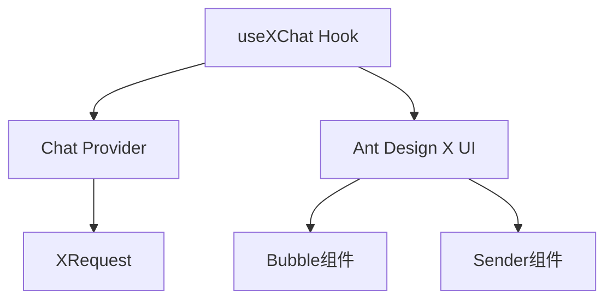

# 🎯 技能定位

> **核心定位**：使用 `useXChat` Hook 构建专业级 AI 对话应用 **前置要求**：已具备自定义 Chat Provider（参考 [x-chat-provider 技能](../x-chat-provider)）

## 目录导航

- [🚀 快速开始](#-快速开始) - 5分钟上手
  - [依赖管理](#1-依赖管理)
  - [三步集成](#2-三步集成)
- [🧩 核心概念](#-核心概念)
  - [技术栈架构](#技术栈架构)
  - [数据模型](#数据模型)
- [🔧 核心功能详解](#-核心功能详解)
  - [消息管理](#1-消息管理)
  - [请求控制](#2-请求控制)
  - [错误处理](#3-错误处理)
  - [完整示例项目](#-完整示例项目)
- [📋 使用前提和依赖](#-使用前提和依赖)
- [🚨 开发规则](#-开发规则)
- [🔗 参考资源](#-参考资源)
  - [API.md](reference/API.md)
  - [EXAMPLES.md](reference/EXAMPLES.md)

# 🚀 快速开始

## 1. 依赖管理

### 🎯 自动依赖处理

### 📋 系统要求

- **@ant-design/x-sdk**: 2.2.1+（自动安装）
- **@ant-design/x**: 最新版（UI组件，自动安装）

### ⚠️ 版本问题自动修复

如果检测到版本不匹配，技能会自动：

- ✅ 提示当前版本状态
- ✅ 提供修复建议
- ✅ 使用相对路径确保兼容性

#### 🎯 技能内置版本检查

use-x-chat 技能已内置版本检查功能，启动时自动检查版本兼容性：

**🔍 自动检查功能** 技能启动时会自动检查 `@ant-design/x-sdk` 版本是否符合要求（≥2.2.1）：

**📋 检查内容包括：**

- ✅ 当前安装的版本
- ✅ 是否符合最低要求（≥2.2.1）
- ✅ 自动提供修复建议
- ✅ 友好的错误提示

**🛠️ 版本问题修复** 如果检测到版本不匹配，技能会提供具体的修复命令：

```bash
# 自动提示的修复命令
npm install @ant-design/x-sdk@^2.2.1

# 或安装最新版本
npm install @ant-design/x-sdk@latest
```

## 2. 三步集成

### 步骤1：准备 Provider

这部分由 x-chat-provider 技能负责

```ts
import { MyChatProvider } from './MyChatProvider';
import { XRequest } from '@ant-design/x-sdk';

// 推荐使用 XRequest 作为默认请求方式
const provider = new MyChatProvider({
  // 默认使用 XRequest，无需自定义 fetch
  request: XRequest('https://your-api.com/chat'),
});
```

### 步骤2：基础使用

```tsx
import { useXChat } from '@ant-design/x-sdk';

const ChatComponent = () => {
  const { messages, onRequest, isRequesting } = useXChat({ provider });

  return (
    <div>
      {messages.map((msg) => (
        <div key={msg.id}>
          {msg.message.role}: {msg.message.content}
        </div>
      ))}
      <button onClick={() => onRequest({ query: '你好' })}>发送</button>
    </div>
  );
};
```

### 步骤3：UI集成

```tsx
import { Bubble, Sender } from '@ant-design/x';

const ChatUI = () => {
  const { messages, onRequest, isRequesting, abort } = useXChat({ provider });

  return (
    <div style={{ height: 600 }}>
      <Bubble.List items={messages} />
      <Sender
        loading={isRequesting}
        onSubmit={(content) => onRequest({ query: content })}
        onCancel={abort}
      />
    </div>
  );
};
```

# 🧩 核心概念

## 技术栈架构



### 数据模型

> ⚠️ **重要提醒**：`messages` 类型是 `MessageInfo<MessageType>[]`，不是直接的 `MessageType`

```ts
interface MessageInfo<Message> {
  id: number | string; // 消息唯一标识
  message: Message; // 实际消息内容
  status: MessageStatus; // 发送状态
  extraInfo?: AnyObject; // 扩展信息
}

// 消息状态枚举
type MessageStatus = 'local' | 'loading' | 'updating' | 'success' | 'error' | 'abort';
```

# 🔧 核心功能详解

> 💡 **提示**：API可能会随版本更新，建议查看[官方文档](https://github.com/ant-design/x/blob/main/packages/x/docs/x-sdk/use-x-chat.zh-CN.md)获取最新信息

核心功能参考内容 [CORE.md](reference/CORE.md)

# 📋 使用前提和依赖

## ⚠️ 重要依赖

**use-x-chat 必须依赖以下技能之一：**

| 依赖类型 | 技能 | 说明 | 是否必须 |
| --- | --- | --- | --- |
| **核心依赖** | **x-chat-provider** | 提供自定义 Provider 实例，默认使用 XRequest, **必须**配合 use-x-chat | **必须** |
| **或** | **内置 Provider** | OpenAI/DeepSeek 等内置 Provider，默认使用 XRequest | **必须** |
| **推荐依赖** | **x-request** | 配置请求参数和认证，作为默认请求方式 | **推荐** |

## 🎯 使用场景对照表

| 使用场景         | 需要的技能组合                           | 使用顺序               |
| ---------------- | ---------------------------------------- | ---------------------- |
| **私有API适配**  | x-chat-provider → use-x-chat             | 先创建Provider，再使用 |
| **标准API使用**  | use-x-chat（内置Provider）               | 直接使用               |
| **需要认证配置** | x-request → use-x-chat                   | 先配置请求，再使用     |
| **完整自定义**   | x-chat-provider → x-request → use-x-chat | 完整工作流             |

# 🚨 开发规则

## 使用 use-x-chat 前必须确认：

- [ ] **已有 Provider 来源**（以下二选一）：
  - [ ] 已用 **x-chat-provider** 创建自定义 Provider
  - [ ] 决定使用内置 Provider（OpenAI/DeepSeek）
- [ ] 已安装 @ant-design/x-sdk
- [ ] 已了解 MessageInfo 数据结构
- [ ] 已准备好 UI 组件

### 测试用例规则

- **如果用户没有明确需要测试用例，则不要添加测试文件**
- **仅在用户明确要求时才创建测试用例**

### 代码质量规则

- **完成编写后必须检查类型**：运行 `tsc --noEmit` 确保无类型错误
- **保持代码整洁**：移除所有未使用的变量和导入

# 🔗 参考资源

## 📚 核心参考文档

- [API.md](reference/API.md) - 完整的 API 参考文档
- [EXAMPLES.md](reference/EXAMPLES.md) - 所有实战示例代码

## 🌐 SDK官方文档

- [useXChat 官方文档](https://github.com/ant-design/x/blob/main/packages/x/docs/x-sdk/use-x-chat.zh-CN.md)
- [XRequest 官方文档](https://github.com/ant-design/x/blob/main/packages/x/docs/x-sdk/x-request.zh-CN.md)
- [Chat Provider 官方文档](https://github.com/ant-design/x/blob/main/packages/x/docs/x-sdk/chat-provider.zh-CN.md)

### 💻 示例代码

- [custom-provider-width-ui.tsx](https://github.com/ant-design/x/blob/main/packages/x/docs/x-sdk/demos/chat-providers/custom-provider-width-ui.tsx) - 自定义 Provider 完整示例
