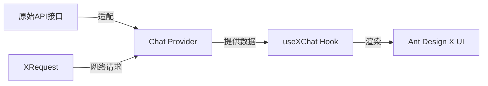
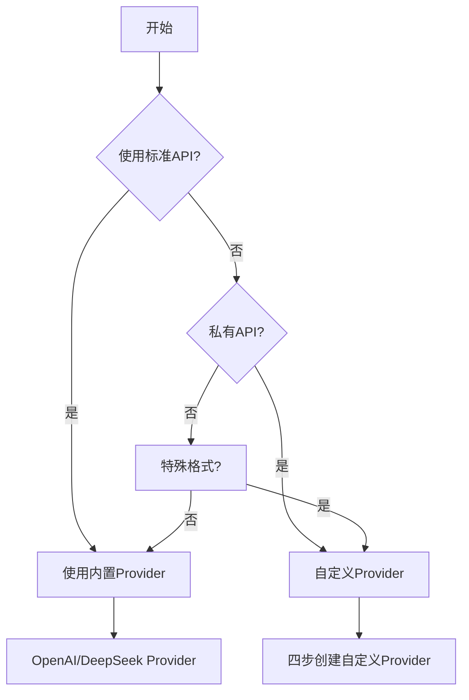
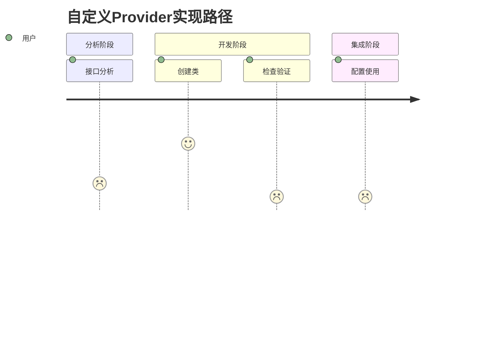
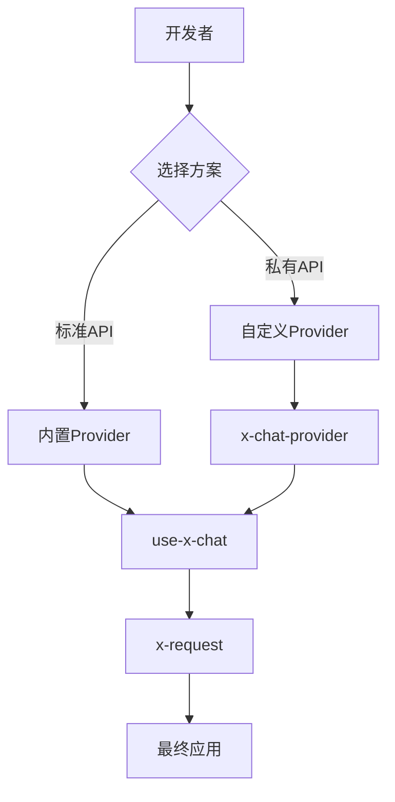
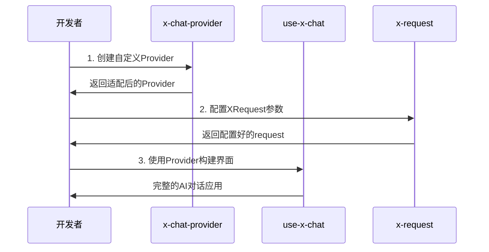
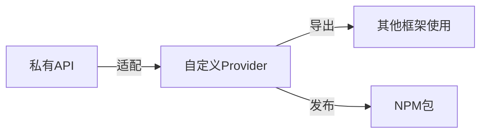
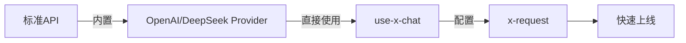

# 🎯 技能定位

**本技能专注解决一个问题**：如何将你的流式接口快速适配为 Ant Design X 的 Chat Provider。

**不涉及的**：useXChat 的使用教程（那是另一个技能）。

## 目录导航

- [📦 技术栈概览](#-技术栈概览)
  - [Ant Design X 生态](#ant-design-x-生态)
  - [核心概念](#核心概念)
- [🚀 快速开始](#-快速开始)
  - [依赖管理](#依赖管理)
  - [内置 Provider](#内置-provider)
  - [何时需要自定义 Provider](#何时需要自定义-provider)
- [📋 四步实现自定义 Provider](#-四步实现自定义-provider)
  - [步骤1：分析接口格式](#步骤1分析接口格式)
  - [步骤2：创建 Provider 类](#步骤2创建-provider-类)
  - [步骤3：检查文件](#步骤3检查文件)
  - [步骤4：使用 Provider](#步骤4使用-provider)
- [🔧 常见场景适配](#-常见场景适配)
- [📋 联合技能使用](#-联合技能使用)
  - [场景1：完整AI对话应用](#场景1完整ai对话应用)
  - [场景2：仅创建Provider](#场景2仅创建provider)
  - [场景3：使用内置Provider](#场景3使用内置provider)
- [⚠️ 重要提醒](#️-重要提醒)
  - [强制规则：禁止自己写 request 方法](#强制规则禁止自己写-request-方法)
- [⚡ 快速检查清单](#-快速检查清单)
- [🚨 开发规则](#-开发规则)
- [参考文件](#参考文件)

## 📦 技术栈概览

### 🏗️ Ant Design X 生态架构

| 层级       | 包名                       | 核心作用        | 典型使用场景               |
| ---------- | -------------------------- | --------------- | -------------------------- |
| **UI层**   | **@ant-design/x**          | React UI 组件库 | 构建聊天界面、气泡、输入框 |
| **逻辑层** | **@ant-design/x-sdk**      | 开发工具包      | 数据流管理、Provider、Hook |
| **渲染层** | **@ant-design/x-markdown** | Markdown 渲染器 | 内容展示、代码高亮         |

> ⚠️ **重要提醒**：这三个包功能定位不同，请务必从正确的包导入所需功能
>
> ```ts
> // ✅ 正确导入示例
> import { Bubble } from '@ant-design/x'; // UI组件
> import { AbstractChatProvider } from '@ant-design/x-sdk'; // Provider基类
> import { XRequest } from '@ant-design/x-sdk'; // 请求工具
> ```

### 🔑 核心概念解析



| 概念 | 角色定位 | 核心职责 | 使用场景 |
| --- | --- | --- | --- |
| **Chat Provider** | 🔄 数据适配器 | 将任意接口格式转换为Ant Design X标准格式 | 私有API适配、格式转换 |
| **useXChat** | ⚛️ React Hook | 管理对话状态、消息流、请求控制 | 构建AI对话界面 |
| **XRequest** | 🌐 请求工具 | 处理所有网络通信、认证、错误处理 | 统一请求管理 |

## 🚀 快速开始

### 📋 环境准备

#### 系统要求

| 依赖包                | 版本要求 | 自动安装 | 作用                        |
| --------------------- | -------- | -------- | --------------------------- |
| **@ant-design/x-sdk** | ≥2.2.1   | ✅       | 核心SDK，包含Provider和Hook |
| **@ant-design/x**     | 最新版   | ✅       | UI组件库，构建聊天界面      |

#### 🛠️ 一键环境检查

```bash
# 自动检查并修复版本
npm ls @ant-design/x-sdk
# 如版本不符，自动提示：
npm install @ant-design/x-sdk@latest
```

#### 📊 版本兼容性矩阵

| SDK版本 | 支持功能         | 兼容性      |
| ------- | ---------------- | ----------- |
| ≥2.2.1  | 完整Provider功能 | ✅ 推荐     |
| 2.2.0   | 基础功能         | ⚠️ 部分兼容 |
| <2.2.0  | 不支持           | ❌ 需升级   |

### 🎯 Provider选择决策树



### 🏭 内置Provider速览

#### 开箱即用的Provider

| Provider类型          | 适用场景         | 使用方式     |
| --------------------- | ---------------- | ------------ |
| **OpenAI Provider**   | 标准OpenAI API   | 直接导入使用 |
| **DeepSeek Provider** | 标准DeepSeek API | 直接导入使用 |

#### 快速判断指南

| 场景             | 推荐方案              | 示例                     |
| ---------------- | --------------------- | ------------------------ |
| 调用官方OpenAI   | 内置OpenAI Provider   | `new OpenAIProvider()`   |
| 调用官方DeepSeek | 内置DeepSeek Provider | `new DeepSeekProvider()` |
| 公司内部API      | 自定义Provider        | 见四步实现               |
| 第三方非标API    | 自定义Provider        | 见四步实现               |

# 📋 四步实现自定义 Provider

## 🎯 实现路径总览



## 步骤1：分析接口格式 ⏱️ 2分钟

### 📋 接口信息收集表

| 信息类型     | 示例值                      | 你的接口        |
| ------------ | --------------------------- | --------------- |
| **接口URL**  | `https://your-api.com/chat` | `_____________` |
| **请求方法** | POST                        | `_____________` |
| **请求格式** | JSON                        | `_____________` |
| **响应格式** | Server-Sent Events          | `_____________` |
| **认证方式** | Bearer Token                | `_____________` |

### 🔍 接口格式模板

#### ✅ 请求格式示例

```ts
// 你的实际请求格式
interface MyAPIRequest {
  query: string; // 用户问题
  context?: string; // 对话历史（可选）
  model?: string; // 模型选择（可选）
  stream?: boolean; // 是否流式（可选）
}
```

#### ✅ 响应格式示例

```ts
// 流式响应格式
// 实际响应：data: {"content": "回答内容"}
interface MyAPIResponse {
  content: string; // 回答片段
  finish_reason?: string; // 结束标记
}

// 结束标记：data: [DONE]
```

## 步骤2：创建 Provider 类 ⏱️ 5分钟

### 🏗️ 代码模板（复制即用）

```ts
// MyChatProvider.ts
import { AbstractChatProvider } from '@ant-design/x-sdk';

// ====== 第1处修改：定义你的接口类型 ======
interface MyInput {
  query: string;
  context?: string;
  model?: string;
  stream?: boolean;
}

interface MyOutput {
  content: string;
  finish_reason?: string;
}

interface MyMessage {
  content: string;
  role: 'user' | 'assistant';
  timestamp: number;
}

// ====== 第2处修改：修改类名 ======
export class MyChatProvider extends AbstractChatProvider<MyMessage, MyInput, MyOutput> {
  // 参数转换：将useXChat参数转为你的API参数
  transformParams(
    requestParams: Partial<MyInput>,
    options: XRequestOptions<MyInput, MyOutput, MyMessage>,
  ): MyInput {
    if (typeof requestParams !== 'object') {
      throw new Error('requestParams must be an object');
    }

    return {
      query: requestParams.query || '',
      context: requestParams.context,
      model: 'gpt-3.5-turbo', // 根据你的API调整
      stream: true,
      ...(options?.params || {}),
    };
  }

  // 本地消息：用户发送的消息格式
  transformLocalMessage(requestParams: Partial<MyInput>): MyMessage {
    return {
      content: requestParams.query || '',
      role: 'user',
      timestamp: Date.now(),
    };
  }

  // ====== 第3处修改：响应数据转换 ======
  transformMessage(info: { originMessage: MyMessage; chunk: MyOutput }): MyMessage {
    const { originMessage, chunk } = info;

    // 处理结束标记
    if (!chunk?.content || chunk.content === '[DONE]') {
      return { ...originMessage, status: 'success' as const };
    }

    // 累加响应内容
    return {
      ...originMessage,
      content: `${originMessage.content || ''}${chunk.content || ''}`,
      role: 'assistant' as const,
      status: 'loading' as const,
    };
  }
}
```

### 🚨 开发注意事项

- ✅ **只改3个地方**：接口类型、类名、响应转换逻辑
- ✅ **禁止实现request方法**：网络请求由XRequest处理
- ✅ **保持类型安全**：使用TypeScript严格模式

## 步骤3：检查验证 ⏱️ 1分钟

### ✅ 快速检查清单

| 检查项            | 状态 | 说明                        |
| ----------------- | ---- | --------------------------- |
| **类名正确**      | ⏳   | `MyChatProvider` → 你的类名 |
| **类型匹配**      | ⏳   | 接口类型与实际API一致       |
| **方法完整**      | ⏳   | 3个方法都已实现             |
| **无request方法** | ⏳   | 确认没有实现request方法     |
| **类型检查通过**  | ⏳   | `tsc --noEmit` 无错误       |

### 🔍 验证代码

```bash
# 运行类型检查
npx tsc --noEmit MyChatProvider.ts

# 预期结果：无错误输出
```

## 步骤4：配置使用 ⏱️ 1分钟

### 🔧 完整集成示例

```ts
// 1. 引入依赖
import { MyChatProvider } from './MyChatProvider';
import { XRequest } from '@ant-design/x-sdk';

// 2. 配置XRequest（由x-request技能负责）
const request = XRequest('https://your-api.com/chat', {
  // 认证配置
  headers: {
    Authorization: 'Bearer your-token-here',
    'Content-Type': 'application/json',
  },

  // 默认参数
  params: {
    model: 'gpt-3.5-turbo',
    max_tokens: 1000,
    temperature: 0.7,
  },

  // 流式配置
  manual: true,
});

// 3. 创建Provider实例
const provider = new MyChatProvider({
  request, // 必须传入XRequest实例
});

// 4. 现在可以配合useXChat使用
// 这部分由use-x-chat技能负责
export { provider };
```

### 🎉 使用优势

- **零网络代码**：XRequest处理所有网络细节
- **类型安全**：完整的TypeScript支持
- **易于测试**：可mock XRequest进行单元测试
- **统一配置**：认证、参数、错误处理集中管理

# 🔧 常见场景适配

## 📚 场景适配指南

| 场景类型 | 难度 | 示例链接 | 说明 |
| --- | --- | --- | --- |
| **标准OpenAI** | 🟢 简单 | [内置Provider示例](reference/EXAMPLES.md#场景1：OpenAI 格式) | 直接使用内置Provider |
| **标准DeepSeek** | 🟢 简单 | [内置Provider示例](reference/EXAMPLES.md#场景2 DeepSeek 格式) | 直接使用内置Provider |
| **私有API** | 🟡 中等 | [自定义Provider的一些细节场景](reference/EXAMPLES.md#场景3：自定义 provider) | 需要四步实现 |

> 📖 **完整示例**：[EXAMPLES.md](reference/EXAMPLES.md) 包含所有实际场景的完整代码

# 📋 联合技能使用指南

## 🎯 技能关系图谱



## 📊 技能对照表

| 技能角色      | 技能名称            | 前置条件     | 核心职责           | 使用场景         |
| ------------- | ------------------- | ------------ | ------------------ | ---------------- |
| **🏗️ 创建者** | **x-chat-provider** | 无           | 创建自定义Provider | 适配私有/非标API |
| **⚛️ 使用者** | **use-x-chat**      | 需要Provider | 构建AI对话界面     | React组件开发    |
| **🔧 配置者** | **x-request**       | 无           | 配置请求参数认证   | 统一网络请求管理 |

## 🎯 组合使用场景详解

### 🚀 场景1：完整AI对话应用

**适用**：从零构建完整的AI对话产品



**实施步骤**：

1. **x-chat-provider** → 创建自定义Provider（4步实现）
2. **x-request** → 配置认证、参数、错误处理
3. **use-x-chat** → 构建React聊天界面

### 🎯 场景2：仅创建Provider

**适用**：为其他框架或团队提供Provider



**核心价值**：

- 🔧 **解耦**：Provider与UI框架分离
- 📦 **复用**：可被多个项目使用
- 🚀 **效率**：一次开发，多处使用

### ⚡ 场景3：使用内置Provider

**适用**：快速原型开发或标准API调用



**优势**：

- ⚡ **零开发**：无需自定义Provider
- 🎯 **零配置**：内置最佳实践
- 🚀 **极速上线**：5分钟即可完成

## ⚠️ 重要提醒

### 🚨 强制规则：禁止自己写 request 方法！

**强制要求**：

- 🚫 **绝对禁止**在 Provider 中实现 `request` 方法
- ✅ **必须使用** XRequest 来处理所有网络请求
- ✅ **只关注**数据转换逻辑（transformParams、transformLocalMessage、transformMessage）

**❌ 严重错误（绝对禁止）**：

```ts
// ❌ 严重错误：自己实现 request 方法
class MyProvider extends AbstractChatProvider {
  async request(params: any) {
    // 禁止自己写网络请求逻辑！
    const response = await fetch(this.url, { ... });
    return response;
  }
}
```

**✅ 强制要求（唯一正确方式）**：

```ts
// ✅ 强制要求：使用 XRequest，禁止实现 request 方法
class MyProvider extends AbstractChatProvider {
  // 禁止实现 request 方法！
  transformParams(params) {
    /* ... */
  }
  transformLocalMessage(params) {
    /* ... */
  }
  transformMessage(info) {
    /* ... */
  }
}

// 强制使用 XRequest：
const provider = new MyProvider({
  request: XRequest('https://your-api.com/chat'),
});
```

# ⚡ 快速检查清单

创建 Provider 前，确认：

- [ ] 已获取接口文档
- [ ] 已确认请求/响应格式
- [ ] 已定义好消息结构
- [ ] 已测试接口可用性
- [ ] **已决定使用 XRequest**（避免自己写 request 方法！）

完成后：

- [ ] Provider 类可以正常实例化
- [ ] **只实现了三个必需方法**（transformParams、transformLocalMessage、transformMessage）
- [ ] **绝对禁止实现 request 方法**（强制使用 XRequest 处理网络请求）
- [ ] 已处理边界情况（空数据、错误响应）
- [ ] **类型检查通过**（确保所有 TypeScript 类型正确）
- [ ] **删除无用导出**（清理未使用的导出项）

# 🚨 开发规则

## 测试用例规则

- **如果用户没有明确需要测试用例，则不要添加测试文件**
- **仅在用户明确要求时才创建测试用例**

## 代码质量规则

- **完成编写后必须检查类型**：运行 `tsc --noEmit` 确保无类型错误
- **保持代码整洁**：移除所有未使用的变量和导入

# 参考文件

### SDK文档

- useXChat: https://github.com/ant-design/x/blob/main/packages/x/docs/x-sdk/use-x-chat.zh-CN.md
- XRequest: https://github.com/ant-design/x/blob/main/packages/x/docs/x-sdk/x-request.zh-CN.md
- chat provider: https://github.com/ant-design/x/blob/main/packages/x/docs/x-sdk/chat-provider.zh-CN.md

### 示例代码

- custom provider width ui: https://github.com/ant-design/x/blob/main/packages/x/docs/x-sdk/demos/chat-providers/custom-provider-width-ui.tsx
