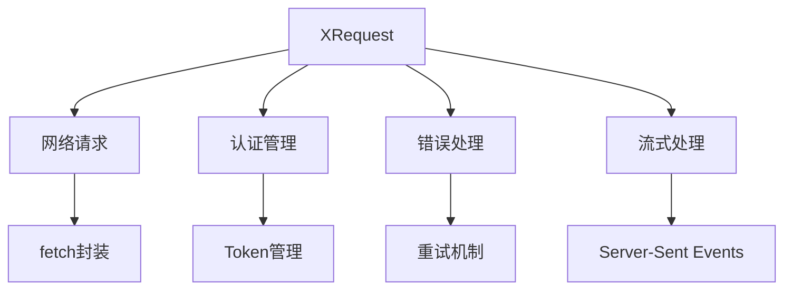
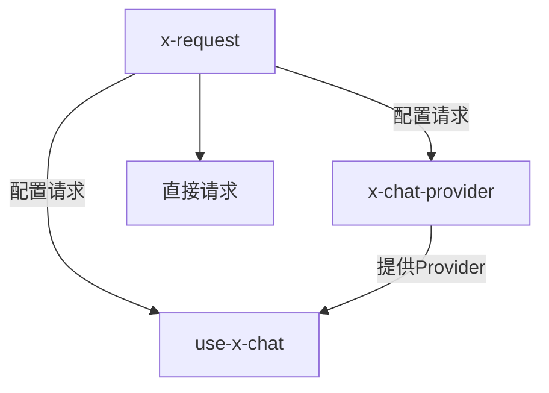
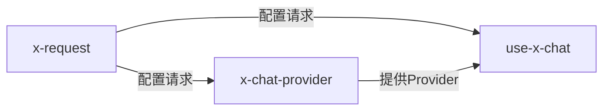

# 🎯 技能定位

**本技能专注解决**：如何正确配置 XRequest 来适配各种流式接口需求。

# 目录导航

- [🚀 快速开始](#-快速开始) - 3分钟上手
  - [依赖管理](#依赖管理)
  - [基础配置](#基础配置)
- [📦 技术栈概览](#-技术栈概览)
- [🔧 核心配置详解](#-核心配置详解)
  - [全局配置](#1-全局配置)
  - [安全配置](#2-安全配置)
  - [流式配置](#3-流式配置)
- [🛡️ 安全指南](#️-安全指南)
  - [环境安全配置](#环境安全配置)
  - [认证方式对比](#认证方式对比)
- [🔍 调试与测试](#-调试与测试)
  - [调试配置](#调试配置)
  - [配置验证](#配置验证)
- [📋 使用场景](#-使用场景)
  - [独立使用](#独立使用)
  - [配合其他技能](#配合其他技能)
- [🚨 开发规则](#-开发规则)
- [🔗 参考资源](#-参考资源) <<<<<<< HEAD
  - [📚 核心参考文档](#-核心参考文档)
  - [🌐 SDK官方文档](#-SDK官方文档)
  - # [💻 示例代码](#-示例代码)
    > > > > > > > 1cf23b141ee7cc4322aa0946f59313c3205bcbb8

# 🚀 快速开始

## 依赖管理

### 📋 系统要求

| 依赖包                | 版本要求 | 自动安装 | 作用                      |
| --------------------- | -------- | -------- | ------------------------- |
| **@ant-design/x-sdk** | ≥2.2.2   | ✅       | 核心SDK，包含XRequest工具 |

### 🛠️ 一键安装

```bash
# 推荐使用 tnpm
tnpm install @ant-design/x-sdk

# 或使用 npm
npm add @ant-design/x-sdk

# 检查版本
npm ls @ant-design/x-sdk
```

## 基础配置

### 最简单的使用方式

```typescript
import { XRequest } from '@ant-design/x-sdk';

// 最简配置：仅需提供API地址
const request = XRequest('https://api.example.com/chat');

// 如需手动控制（用于Provider场景）
const providerRequest = XRequest('https://api.example.com/chat', {
  manual: true, // 仅此项通常需要显式配置
});
```

> 💡 **提示**：XRequest 已内置合理的默认配置，大多数情况下只需提供API地址即可使用。

# 📦 技术栈概览

## 🏗️ 技术栈架构



## 🔑 核心概念

| 概念         | 角色定位    | 核心职责                         | 使用场景     |
| ------------ | ----------- | -------------------------------- | ------------ |
| **XRequest** | 🌐 请求工具 | 处理所有网络通信、认证、错误处理 | 统一请求管理 |
| **全局配置** | ⚙️ 配置中心 | 一次配置，多处使用               | 减少重复代码 |
| **流式配置** | 🔄 流式处理 | 支持SSE和JSON响应格式            | AI对话场景   |

# 🔧 核心配置详解

核心功能参考内容 [CORE.md](reference/CORE.md)

# 🛡️ 安全指南

## 环境安全配置

### 🌍 不同环境的安全策略

| 运行环境        | 安全等级 | 配置方式        | 风险说明             |
| --------------- | -------- | --------------- | -------------------- |
| **浏览器前端**  | 🔴 高危  | ❌ 禁止配置密钥 | 密钥会直接暴露给用户 |
| **Node.js后端** | 🟢 安全  | ✅ 环境变量配置 | 密钥存储在服务器端   |
| **代理服务**    | 🟢 安全  | ✅ 同域代理转发 | 密钥由代理服务管理   |

### 🔐 认证方式对比

| 认证方式           | 适用环境 | 配置示例                        | 安全性  |
| ------------------ | -------- | ------------------------------- | ------- |
| **Bearer Token**   | Node.js  | `Bearer ${process.env.API_KEY}` | ✅ 安全 |
| **API Key Header** | Node.js  | `X-API-Key: ${process.env.KEY}` | ✅ 安全 |
| **代理转发**       | 浏览器   | `/api/proxy/service`            | ✅ 安全 |
| **直接配置**       | 浏览器   | `Bearer sk-xxx`                 | ❌ 危险 |

# 🔍 调试与测试

## 调试配置

### 🛠️ 调试模板

**Node.js调试配置**:

```typescript
// 安全的调试配置（Node.js 环境）
const debugRequest = XRequest('https://your-api.com/chat', {
  headers: {
    Authorization: `Bearer ${process.env.DEBUG_API_KEY}`,
  },
  params: { query: '测试消息' },
});
```

**前端调试配置**:

```typescript
// 安全的调试配置（前端环境）
const debugRequest = XRequest('/api/debug/chat', {
  params: { query: '测试消息' },
});
```

## 配置验证

### ✅ 安全检查工具

```typescript
// 安全配置验证函数
const validateSecurity = (config: any) => {
  const isBrowser = typeof window !== 'undefined';
  const hasAuth = config.headers?.Authorization || config.headers?.authorization;

  if (isBrowser && hasAuth) {
    throw new Error('❌ 前端环境禁止配置 Authorization，存在密钥泄漏风险！');
  }

  console.log('✅ 安全配置检查通过');
  return true;
};

// 使用示例
validateSecurity({
  headers: {
    // 不要包含 Authorization
  },
});
```

# 📋 使用场景

## 独立使用

### 🎯 直接发起请求

```typescript
import { XRequest } from '@ant-design/x-sdk';

// 测试接口可用性
const testRequest = XRequest('https://httpbin.org/post', {
  params: { test: 'data' },
});

// 立即发送请求
const response = await testRequest();
console.log(response);
```

## 配合其他技能

### 🔄 技能协作流程



| 使用方式 | 配合技能 | 作用 | 示例 |
| --- | --- | --- | --- |
| **独立使用** | 无 | 直接发起网络请求 | 测试接口可用性 |
| **配合 x-chat-provider** | x-chat-provider | 为自定义 Provider 配置请求 | 配置私有 API |
| **配合 use-x-chat** | use-x-chat | 为内置 Provider 配置请求 | 配置 OpenAI API |
| **完整 AI 应用** | x-request → x-chat-provider → use-x-chat | 为整个系统配置请求 | 完整 AI 对话应用 |

### ⚠️ useXChat 集成安全警告

**重要警告：useXChat 仅用于前端环境，XRequest 配置中禁止包含 Authorization！**

**❌ 错误配置（危险）**:

```typescript
// 极度危险：密钥会直接暴露给浏览器
const unsafeRequest = XRequest('https://api.openai.com/v1/chat/completions', {
  headers: {
    Authorization: 'Bearer sk-xxxxxxxxxxxxxx', // ❌ 危险！
  },
  manual: true,
});
```

**✅ 正确配置（安全）**:

```typescript
// 前端安全配置：使用代理服务
const safeRequest = XRequest('/api/proxy/openai', {
  params: {
    model: 'gpt-3.5-turbo',
    stream: true,
  },
  manual: true,
});
```

# 🚨 开发规则

## 测试用例规则

- **如果用户没有明确需要测试用例，则不要添加测试文件**
- **仅在用户明确要求时才创建测试用例**

## 代码质量规则

- **完成编写后必须检查类型**：运行 `tsc --noEmit` 确保无类型错误
- **保持代码整洁**：移除所有未使用的变量和导入

## ✅ 配置检查清单

使用 XRequest 前请确认以下配置已正确设置：

### 🔍 配置检查清单

| 检查项         | 状态            | 说明                                                     |
| -------------- | --------------- | -------------------------------------------------------- |
| **API 地址**   | ✅ 必须配置     | `XRequest('https://api.xxx.com')`                        |
| **认证信息**   | ⚠️ 环境相关     | 前端❌禁止，Node.js✅可用                                |
| **manual配置** | ✅ Provider场景 | 在Provider中需要设为`true`，其他场景需要根据实际情况设置 |
| **其他配置**   | ❌ 无需配置     | 已内置合理默认值                                         |
| **接口可用性** | ✅ 建议测试     | 使用调试配置验证                                         |

### 🛠️ 快速验证脚本

```typescript
// 运行前检查配置
const checkConfig = () => {
  const checks = [
    {
      name: '全局配置',
      test: () => {
        // 检查是否已设置全局配置
        return true; // 根据实际情况检查
      },
    },
    {
      name: '安全配置',
      test: () => validateSecurity(globalConfig),
    },
    {
      name: '类型检查',
      test: () => {
        // 运行 tsc --noEmit
        return true;
      },
    },
  ];

  checks.forEach((check) => {
    console.log(`${check.name}: ${check.test() ? '✅' : '❌'}`);
  });
};
```

# <<<<<<< HEAD

# 🔗 参考资源

## 📚 核心文档

| 资源名称 | 链接 | 说明 | 依赖关系 |
| --- | --- | --- | --- |
| **官方文档** | [XRequest 文档](https://github.com/ant-design/x/blob/main/packages/x/docs/x-sdk/x-request.zh-CN.md) | 最新功能说明 | 独立资源 |
| **API参考** | [API.md](reference/API.md) | 完整API文档 | 必读 |
| **服务商配置** | [EXAMPLES_SERVICE_PROVIDER.md](reference/EXAMPLES_SERVICE_PROVIDER.md) | 各服务商配置示例 | 可选 |

> > > > > > > 1cf23b141ee7cc4322aa0946f59313c3205bcbb8

## 🎯 技能协作



### 📊 技能使用对照表

| 使用场景 | 所需技能 | 使用顺序 | 完成时间 |
| --- | --- | --- | --- |
| **测试接口** | x-request | 直接使用 | 2分钟 |
| **私有API适配** | x-request → x-chat-provider | 先配置请求，再创建Provider | 10分钟 |
| **标准AI应用** | x-request → use-x-chat | 先配置请求，再构建界面 | 15分钟 |
| **完整自定义** | x-request → x-chat-provider → use-x-chat | 完整工作流 | 30分钟 |

<<<<<<< HEAD

# 🔗 参考资源

## 📚 核心参考文档

- [API.md](reference/API.md) - 完整的 API 参考文档
- [EXAMPLES_SERVICE_PROVIDER.md](reference/EXAMPLES_SERVICE_PROVIDER.md) - 各服务商配置示例

## 🌐 SDK官方文档

- [useXChat 官方文档](https://github.com/ant-design/x/blob/main/packages/x/docs/x-sdk/use-x-chat.zh-CN.md)
- [XRequest 官方文档](https://github.com/ant-design/x/blob/main/packages/x/docs/x-sdk/x-request.zh-CN.md)
- [Chat Provider 官方文档](https://github.com/ant-design/x/blob/main/packages/x/docs/x-sdk/chat-provider.zh-CN.md)

## 💻 示例代码

- # [custom-provider-width-ui.tsx](https://github.com/ant-design/x/blob/main/packages/x/docs/x-sdk/demos/chat-providers/custom-provider-width-ui.tsx) - 自定义 Provider 完整示例
  > > > > > > > 1cf23b141ee7cc4322aa0946f59313c3205bcbb8
