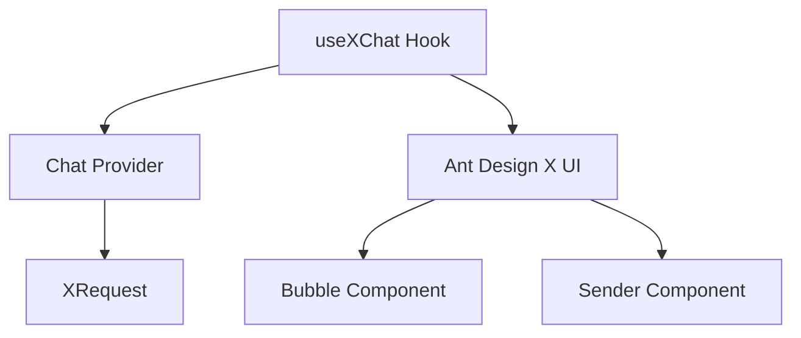

# 🎯 Skill Positioning

<<<<<<< HEAD

> # **Core Positioning**: Using `useXChat` Hook to build professional AI conversation applications **Prerequisites**: Already have custom Chat Provider (refer to [x-chat-provider skill](../x-chat-provider))
>
> **Core Positioning**: Using the `useXChat` Hook to build professional AI conversation applications **Prerequisites**: Already have a custom Chat Provider (refer to [x-chat-provider skill](../x-chat-provider))
>
> > > > > > > 1cf23b141ee7cc4322aa0946f59313c3205bcbb8

## Table of Contents

- [🚀 Quick Start](#-quick-start)
  - [Dependency Management](#1-dependency-management) <<<<<<< HEAD
  - [Three-step Integration](#2-three-step-integration)
- [🧩 Core Concepts](#-core-concepts)
  - [Tech Stack Architecture](#tech-stack-architecture)
  - [Data Model](#data-model)
- # [🔧 Core Function Details](#-core-function-details)
  - [Three-Step Integration](#2-three-step-integration)
- [🧩 Core Concepts](#-core-concepts)
  - [Technology Stack Architecture](#technology-stack-architecture)
  - [Data Model](#data-model)
- [🔧 Core Features Explained](#-core-features-explained)
  > > > > > > > 1cf23b141ee7cc4322aa0946f59313c3205bcbb8
  - [Message Management](#1-message-management)
  - [Request Control](#2-request-control)
  - [Error Handling](#3-error-handling)
  - [Complete Example Project](#-complete-example-project)
- [📋 Prerequisites and Dependencies](#-prerequisites-and-dependencies)
- [🚨 Development Rules](#-development-rules)
- [🔗 Reference Resources](#-reference-resources) <<<<<<< HEAD
  - [📚 Core Reference Documents](#-core-reference-documents)
  - [🌐 SDK Official Documentation](#-sdk-official-documentation)
  - # [💻 Example Code](#-example-code)
  - [API.md](reference/API.md)
  - [EXAMPLES.md](reference/EXAMPLES.md)
    > > > > > > > 1cf23b141ee7cc4322aa0946f59313c3205bcbb8

# 🚀 Quick Start

## 1. Dependency Management

### 🎯 Automatic Dependency Handling

### 📋 System Requirements

<<<<<<< HEAD

- **@ant-design/x-sdk**: 2.2.2+ (auto install)
- **@ant-design/x**: Latest version (UI components, auto install)

### ⚠️ Version Issue Auto Fix

# If version mismatch is detected, the skill will automatically:

- **@ant-design/x-sdk**: 2.2.2+ (auto-installed)
- **@ant-design/x**: latest (UI components, auto-installed)

### ⚠️ Automatic Version Issue Resolution

If version mismatches are detected, the skill will automatically:

> > > > > > > 1cf23b141ee7cc4322aa0946f59313c3205bcbb8

- ✅ Prompt current version status
- ✅ Provide fix suggestions
- ✅ Use relative paths to ensure compatibility

<<<<<<< HEAD

#### 🎯 Skill Built-in Version Check

use-x-chat skill has built-in version check functionality, automatically checks version compatibility on startup:

**🔍 Auto Check Function** When skill starts, it automatically checks if `@ant-design/x-sdk` version meets requirements (≥2.2.2):

**📋 Check Contents Include:**

- ✅ Currently installed version
- ✅ Whether minimum requirements are met (≥2.2.2)
- ✅ Auto provide fix suggestions
- ✅ Friendly error prompts

**🛠️ Version Issue Fix** If version mismatch is detected, skill will provide specific fix commands:

````bash
# Auto prompted fix commands
=======
#### 🎯 Built-in Version Check

The use-x-chat skill includes built-in version checking functionality, automatically checking version compatibility on startup:

**🔍 Automatic Check Features** When the skill starts, it automatically checks if the `@ant-design/x-sdk` version meets requirements (≥2.2.2):

**📋 Check Contents:**

- ✅ Currently installed version
- ✅ Whether it meets minimum requirements (≥2.2.2)
- ✅ Automatically provides fix suggestions
- ✅ Friendly error prompts

**🛠️ Version Issue Fixes** If version mismatches are detected, the skill provides specific fix commands:

```bash
# Auto-suggested fix commands
>>>>>>> 1cf23b141ee7cc4322aa0946f59313c3205bcbb8
npm install @ant-design/x-sdk@^2.2.2

# Or install latest version
npm install @ant-design/x-sdk@latest
````

<<<<<<< HEAD

## 2. Three-step Integration

### Step 1: Prepare Provider

# This part is handled by x-chat-provider skill

## 2. Three-Step Integration

### Step 1: Prepare Provider

This part is handled by the x-chat-provider skill

> > > > > > > 1cf23b141ee7cc4322aa0946f59313c3205bcbb8

```ts
import { MyChatProvider } from './MyChatProvider';
import { XRequest } from '@ant-design/x-sdk';

<<<<<<< HEAD
// Recommended to use XRequest as default request method
const provider = new MyChatProvider({
  // Default use XRequest, no need for custom fetch
  request: XRequest('https://your-api.com/chat'),
  // When setting requestPlaceholder, will display placeholder message before request starts
=======
// Recommended to use XRequest as the default request method
const provider = new MyChatProvider({
  // Default use of XRequest, no custom fetch needed
  request: XRequest('https://your-api.com/chat'),
  // When requestPlaceholder is set, placeholder messages will display before requests start
>>>>>>> 1cf23b141ee7cc4322aa0946f59313c3205bcbb8
  requestPlaceholder: {
    content: 'Thinking...',
    role: 'assistant',
    timestamp: Date.now(),
  },
<<<<<<< HEAD
  // When setting requestFallback, will display fallback message when request fails
=======
  // When requestFallback is set, fallback messages will display when requests fail
>>>>>>> 1cf23b141ee7cc4322aa0946f59313c3205bcbb8
  requestFallback: (_, { error, errorInfo, messageInfo }) => {
    if (error.name === 'AbortError') {
      return {
        content: messageInfo?.message?.content || 'Reply cancelled',
        role: 'assistant' as const,
        timestamp: Date.now(),
      };
    }
    return {
      content: errorInfo?.error?.message || 'Network error, please try again later',
      role: 'assistant' as const,
      timestamp: Date.now(),
    };
  },
});
```

### Step 2: Basic Usage

```tsx
import { useXChat } from '@ant-design/x-sdk';

const ChatComponent = () => {
  const { messages, onRequest, isRequesting } = useXChat({ provider });

  return (
    <div>
      {messages.map((msg) => (
        <div key={msg.id}>
          {msg.message.role}: {msg.message.content}
        </div>
      ))}
      <button onClick={() => onRequest({ query: 'Hello' })}>Send</button>
    </div>
  );
};
```

### Step 3: UI Integration

```tsx
import { Bubble, Sender } from '@ant-design/x';

const ChatUI = () => {
  const { messages, onRequest, isRequesting, abort } = useXChat({ provider });

  return (
    <div style={{ height: 600 }}>
      <Bubble.List items={messages} />
      <Sender
        loading={isRequesting}
        onSubmit={(content) => onRequest({ query: content })}
        onCancel={abort}
      />
    </div>
  );
};
```

# 🧩 Core Concepts

<<<<<<< HEAD

## Tech Stack Architecture

=======

## Technology Stack Architecture

> > > > > > > 1cf23b141ee7cc4322aa0946f59313c3205bcbb8



### Data Model

<<<<<<< HEAD

> ⚠️ **Important Reminder**: `messages` type is `MessageInfo<MessageType>[]`, not direct `MessageType`

````ts
interface MessageInfo<Message> {
  id: number | string; // Message unique identifier
  message: Message; // Actual message content
  status: MessageStatus; // Send status
=======
> ⚠️ **Important Reminder**: The `messages` type is `MessageInfo<MessageType>[]`, not directly `MessageType`

```ts
interface MessageInfo<Message> {
  id: number | string; // Unique message identifier
  message: Message; // Actual message content
  status: MessageStatus; // Sending status
>>>>>>> 1cf23b141ee7cc4322aa0946f59313c3205bcbb8
  extraInfo?: AnyObject; // Extended information
}

// Message status enum
type MessageStatus = 'local' | 'loading' | 'updating' | 'success' | 'error' | 'abort';
````

<<<<<<< HEAD

# 🔧 Core Function Details

> 💡 **Tip**: API may update with versions, recommend checking [official documentation](https://github.com/ant-design/x/blob/main/packages/x/docs/x-sdk/use-x-chat.en-US.md) for latest information

# Core functionality reference content [CORE.md](reference/CORE.md)

# 🔧 Core Features Explained

> 💡 **Tip**: APIs may update with versions, it's recommended to check [official documentation](https://github.com/ant-design/x/blob/main/packages/x/docs/x-sdk/use-x-chat.md) for the latest information

Core features reference content [CORE.md](reference/CORE.md)

> > > > > > > 1cf23b141ee7cc4322aa0946f59313c3205bcbb8

# 📋 Prerequisites and Dependencies

## ⚠️ Important Dependencies

**use-x-chat must depend on one of the following skills:**

| Dependency Type | Skill | Description | Required |
| --------------- | ----- | ----------- | -------- |

<<<<<<< HEAD | **Core Dependency** | **x-chat-provider** | Provides custom Provider instance, default uses XRequest, **must** cooperate with use-x-chat | **Required** | | **Or** | **Built-in Provider** | OpenAI/DeepSeek and other built-in Providers, default uses XRequest | **Required** | | **Recommended Dependency** | **x-request** | Configure request parameters and authentication, as default request method | **Recommended** | ======= | **Core Dependency** | **x-chat-provider** | Provides custom Provider instances, uses XRequest by default, **must** be used with use-x-chat | **Required** | | **Or** | **Built-in Provider** | Built-in Providers like OpenAI/DeepSeek, uses XRequest by default | **Required** | | **Recommended** | **x-request** | Configure request parameters and authentication, as the default request method | **Recommended** |

> > > > > > > 1cf23b141ee7cc4322aa0946f59313c3205bcbb8

## 🎯 Usage Scenario Comparison Table

| Usage Scenario             | Required Skill Combination   | Usage Order                     |
| -------------------------- | ---------------------------- | ------------------------------- |
| **Private API Adaptation** | x-chat-provider → use-x-chat | Create Provider first, then use |

<<<<<<< HEAD | **Standard API Usage** | use-x-chat (built-in Provider) | Direct use | | **Need Authentication Configuration** | x-request → use-x-chat | Configure request first, then use | | **Complete Customization** | x-chat-provider → x-request → use-x-chat | Complete workflow |

# 🚨 Development Rules

## Before using use-x-chat must confirm:

- [ ] **Has Provider source** (choose one of the following):
  - [ ] Has used **x-chat-provider** to create custom Provider
  - [ ] Decided to use built-in Provider (OpenAI/DeepSeek)
- [ ] Has installed @ant-design/x-sdk
- [ ] Has understood MessageInfo data structure
- [ ] Has prepared UI components

### Test Case Rules

- **If user doesn't explicitly need test cases, don't add test files**
- **Only create test cases when user explicitly requests**

### Code Quality Rules

- # **Must check types after completion**: Run `tsc --noEmit` to ensure no type errors
  | **Standard API Usage** | use-x-chat (built-in Provider) | Use directly | | **Authentication Required** | x-request → use-x-chat | Configure request first, then use | | **Full Customization** | x-chat-provider → x-request → use-x-chat | Complete workflow |

# 🚨 Development Rules

## Before using use-x-chat, you must confirm:

- [ ] **Provider source** (choose one of the following):
  - [ ] Used **x-chat-provider** to create custom Provider
  - [ ] Decided to use built-in Provider (OpenAI/DeepSeek)
- [ ] Installed @ant-design/x-sdk
- [ ] Understand MessageInfo data structure
- [ ] Prepared UI components

### Test Case Rules

- **If the user doesn't explicitly need test cases, don't add test files**
- **Only create test cases when the user explicitly requests**

### Code Quality Rules

- **After completion, must check types**: Run `tsc --noEmit` to ensure no type errors
  > > > > > > > 1cf23b141ee7cc4322aa0946f59313c3205bcbb8
- **Keep code clean**: Remove all unused variables and imports

# 🔗 Reference Resources

<<<<<<< HEAD

## 📚 Core Reference Documents

=======

## 📚 Core Reference Documentation

> > > > > > > 1cf23b141ee7cc4322aa0946f59313c3205bcbb8

- [API.md](reference/API.md) - Complete API reference documentation
- [EXAMPLES.md](reference/EXAMPLES.md) - All practical example code

## 🌐 SDK Official Documentation

<<<<<<< HEAD

- [useXChat Official Documentation](https://github.com/ant-design/x/blob/main/packages/x/docs/x-sdk/use-x-chat.en-US.md)
- [XRequest Official Documentation](https://github.com/ant-design/x/blob/main/packages/x/docs/x-sdk/x-request.en-US.md)
- [Chat Provider Official Documentation](https://github.com/ant-design/x/blob/main/packages/x/docs/x-sdk/chat-provider.en-US.md)

## 💻 Example Code

- # [custom-provider-width-ui.tsx](https://github.com/ant-design/x/blob/main/packages/x/docs/x-sdk/demos/chat-providers/custom-provider-width-ui.tsx) - Custom Provider complete example
- [useXChat Official Documentation](https://github.com/ant-design/x/blob/main/packages/x/docs/x-sdk/use-x-chat.md)
- [XRequest Official Documentation](https://github.com/ant-design/x/blob/main/packages/x/docs/x-sdk/x-request.md)
- [Chat Provider Official Documentation](https://github.com/ant-design/x/blob/main/packages/x/docs/x-sdk/chat-provider.md)

### 💻 Example Code

- [custom-provider-width-ui.tsx](https://github.com/ant-design/x/blob/main/packages/x/docs/x-sdk/demos/chat-providers/custom-provider-width-ui.tsx) - Complete custom Provider example
  > > > > > > > 1cf23b141ee7cc4322aa0946f59313c3205bcbb8
