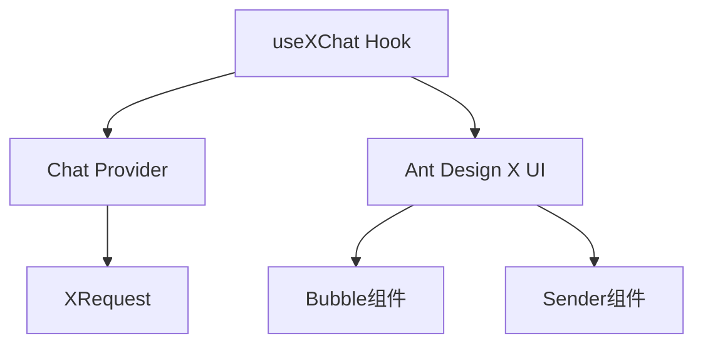

# 🎯 useXChat 完全指南

> **核心定位**：使用 `useXChat` Hook 构建专业级 AI 对话应用
>
> **前置要求**：已具备自定义 Chat Provider（参考 [x-chat-provider 技能](./x-chat-provider)）

## 目录导航

- [快速开始](#-快速开始) - 5分钟上手
- [核心概念](#-核心概念) - 理解基础架构
- [API详解](#-api详解) - 掌握所有功能
- [实战案例](#-实战案例) - 真实场景应用
- [最佳实践](#-最佳实践) - 避坑指南

## 🚀 快速开始

### 1. 依赖管理

#### 🎯 自动依赖处理

#### 📋 系统要求

- **@ant-design/x-sdk**: 2.2.1+（自动安装）
- **@ant-design/x**: 最新版（UI组件，自动安装）

#### ⚠️ 版本问题自动修复

如果检测到版本不匹配，技能会自动：

- ✅ 提示当前版本状态
- ✅ 提供修复建议
- ✅ 使用相对路径确保兼容性

#### 🎯 技能内置版本检查

use-x-chat 技能已内置版本检查功能，启动时自动检查版本兼容性：

**🔍 自动检查功能** 技能启动时会自动检查 `@ant-design/x-sdk` 版本是否符合要求（≥2.2.1）：

**📋 检查内容包括：**

- ✅ 当前安装的版本
- ✅ 是否符合最低要求（≥2.2.1）
- ✅ 自动提供修复建议
- ✅ 友好的错误提示

**🛠️ 版本问题修复** 如果检测到版本不匹配，技能会提供具体的修复命令：

```bash
# 自动提示的修复命令
npm install @ant-design/x-sdk@^2.2.1

# 或安装最新版本
npm install @ant-design/x-sdk@latest
```

### 2. 三步集成

#### 步骤1：准备 Provider

这部分由 x-chat-provider 技能负责

```ts
import { MyChatProvider } from './MyChatProvider';
import { XRequest } from '@ant-design/x-sdk';

// 推荐使用 XRequest 作为默认请求方式
const provider = new MyChatProvider({
  // 默认使用 XRequest，无需自定义 fetch
  request: XRequest('https://your-api.com/chat'),
});
```

#### 步骤2：基础使用

```tsx
import { useXChat } from '@ant-design/x-sdk';

const ChatComponent = () => {
  const { messages, onRequest, isRequesting } = useXChat({ provider });

  return (
    <div>
      {messages.map((msg) => (
        <div key={msg.id}>
          {msg.message.role}: {msg.message.content}
        </div>
      ))}
      <button onClick={() => onRequest({ query: '你好' })}>发送</button>
    </div>
  );
};
```

#### 步骤3：UI集成

```tsx
import { Bubble, Sender } from '@ant-design/x';

const ChatUI = () => {
  const { messages, onRequest, isRequesting, abort } = useXChat({ provider });

  return (
    <div style={{ height: 600 }}>
      <Bubble.List items={messages} />
      <Sender
        loading={isRequesting}
        onSubmit={(content) => onRequest({ query: content })}
        onCancel={abort}
      />
    </div>
  );
};
```

## 🧩 核心概念

### 技术栈架构



### 数据模型

> ⚠️ **重要提醒**：`messages` 类型是 `MessageInfo<MessageType>[]`，不是直接的 `MessageType`

```ts
interface MessageInfo<Message> {
  id: number | string; // 消息唯一标识
  message: Message; // 实际消息内容
  status: MessageStatus; // 发送状态
  extraInfo?: AnyObject; // 扩展信息
}

// 消息状态枚举
type MessageStatus = 'local' | 'loading' | 'updating' | 'success' | 'error' | 'abort';
```

## 🔧 API详解

> 💡 **提示**：API可能会随版本更新，建议查看[官方文档](https://github.com/ant-design/x/blob/main/packages/x/docs/x-sdk/use-x-chat.zh-CN.md)获取最新信息

### 核心API速览

useXChat Hook 提供了完整的对话管理能力，主要包括：**状态管理**、**请求控制**、**消息操作**三大类功能。

参阅 [API.md](reference/API.md) 获取所有方法。

## 💡 实战案例

参阅 [EXAMPLES.md](reference/EXAMPLES.md) 获取所有示例。

## 🔗 相关资源

## ✅ 开发检查清单

- [ ] 已创建并测试 Chat Provider
- [ ] 已安装 `@ant-design/x-sdk`，且版本要求正确
- [ ] 理解 `MessageInfo` 数据结构
- [ ] 已实现错误处理机制
- [ ] 已集成必要的 UI 组件
- [ ] 已测试消息状态管理

## 🔧 核心功能详解

### 1. 消息管理

#### 获取消息列表

```ts
const { messages } = useXChat({ provider });
// messages 结构: MessageInfo<MessageType>[]
// 实际消息数据在 msg.message 中
```

#### 手动设置消息

```ts
const { setMessages } = useXChat({ provider });

// 清空消息
setMessages([]);

// 添加欢迎消息 - 注意是 MessageInfo 结构
setMessages([
  {
    id: 'welcome',
    message: {
      content: '欢迎使用 AI 助手',
      role: 'assistant',
    },
    status: 'success',
  },
]);
```

#### 更新单条消息

```ts
const { setMessage } = useXChat({ provider });

// 更新消息内容 - 需要更新 message 对象
setMessage('msg-id', {
  message: { content: '新的内容', role: 'assistant' },
});

// 标记为错误 - 更新 status
setMessage('msg-id', { status: 'error' });
```

### 2. 请求控制

#### 发送消息

```ts
const { onRequest } = useXChat({ provider });

// 基础使用
onRequest({ query: '用户问题' });

// 带额外参数
onRequest({
  query: '用户问题',
  context: '之前的对话内容',
  userId: 'user123',
});
```

#### 中断请求

```ts
const { abort, isRequesting } = useXChat({ provider });

// 中断当前请求
<button onClick={abort} disabled={!isRequesting}>
  停止生成
</button>
```

#### 重新发送

重新发送功能允许用户重新生成特定消息的回复，这在AI回答不满意或出现错误时非常有用。

#### 基础使用

```tsx
const ChatComponent = () => {
  const { messages, onReload } = useXChat({ provider });

  return (
    <div>
      {messages.map((msg) => (
        <div key={msg.id}>
          <span>{msg.message.content}</span>
          {msg.message.role === 'assistant' && (
            <button onClick={() => onReload(msg.id)}>重新生成</button>
          )}
        </div>
      ))}
    </div>
  );
};
```

#### 完整示例：带状态管理的重新发送

```tsx
import { useState } from 'react';
import { useXChat } from '@ant-design/x-sdk';
import { Bubble, Button } from '@ant-design/x';

const ChatWithRegenerate = () => {
  const { messages, onReload, isRequesting } = useXChat({
    provider,
    requestFallback: (_, { error }) => ({
      message: {
        content: error.name === 'AbortError' ? '已取消生成' : '生成失败，请重试',
        role: 'assistant',
      },
      status: 'error',
    }),
  });

  // 跟踪正在重新生成的消息ID
  const [regeneratingId, setRegeneratingId] = useState<string | number | null>(null);

  const handleRegenerate = (messageId: string | number) => {
    setRegeneratingId(messageId);
    onReload(
      messageId,
      {},
      {
        extra: { regenerate: true },
      },
    );
  };

  return (
    <div>
      <Bubble.List
        items={messages.map((msg) => ({
          key: msg.id,
          content: msg.message.content,
          role: msg.message.role,
          loading: msg.status === 'loading',
          footer: msg.message.role === 'assistant' && (
            <Button
              type="text"
              size="small"
              loading={regeneratingId === msg.id && isRequesting}
              onClick={() => handleRegenerate(msg.id)}
              disabled={isRequesting && regeneratingId !== msg.id}
            >
              {regeneratingId === msg.id ? '生成中...' : '重新生成'}
            </Button>
          ),
        }))}
      />
    </div>
  );
};
```

#### 重新发送的注意事项

1. **只能重新生成AI回复**：通常只能对 `role === 'assistant'` 的消息使用重新发送
2. **状态管理**：重新发送会将对应消息状态设为 `loading`
3. **参数传递**：可以通过 `extra` 参数传递额外信息给Provider
4. **错误处理**：建议配合 `requestFallback` 处理重新发送失败的情况

### 3. 错误处理

#### 统一错误处理

```ts
const { messages } = useXChat({
  provider,
  requestFallback: (_, { error, messageInfo }) => {
    // 网络错误
    if (!navigator.onLine) {
      return {
        message: {
          content: '网络连接失败，请检查网络',
          role: 'assistant',
        },
        status: 'error',
      };
    }

    // 用户中断
    if (error.name === 'AbortError') {
      return {
        message: {
          content: '已取消生成',
          role: 'assistant',
        },
        status: 'error',
      };
    }

    // 服务器错误
    return {
      message: {
        content: '服务暂时不可用，请稍后重试',
        role: 'assistant',
      },
      status: 'error',
    };
  },
});
```

#### 重试机制

```tsx
const ChatWithRetry: React.FC = () => {
  const { messages, onRequest, onReload, setMessage } = useXChat({ provider });

  return (
    <div>
      {messages.map((msg) => (
        <div key={msg.id}>
          {msg.content}
          <button onClick={onReload}>重试</button>
        </div>
      ))}
    </div>
  );
};
```

### 📊 完整示例项目

```tsx
import React, { useState } from 'react';
import { useXChat } from '@ant-design/x-sdk';
import { Bubble, Sender, Conversations } from '@ant-design/x';

const App: React.FC = () => {
  const [conversations, setConversations] = useState([{ key: '1', label: '新对话' }]);
  const [activeKey, setActiveKey] = useState('1');

  const { messages, onRequest, isRequesting, abort } = useXChat({
    provider,
    requestFallback: (_, { error }) => {
      if (error.name === 'AbortError') {
        return { content: '已取消', role: 'assistant', status: 'error' };
      }
      return { content: '请求失败', role: 'assistant', status: 'error' };
    },
  });

  return (
    <div style={{ display: 'flex', height: '100vh' }}>
      {/* 会话列表 */}
      <Conversations items={conversations} activeKey={activeKey} onActiveChange={setActiveKey} />

      {/* 聊天区域 */}
      <div style={{ flex: 1, display: 'flex', flexDirection: 'column' }}>
        <Bubble.List
          items={messages.map((msg) => ({
            key: msg.id,
            content: msg.content,
            role: msg.role,
            loading: msg.status === 'loading',
          }))}
        />

        <Sender
          loading={isRequesting}
          onSubmit={(content) => onRequest({ query: content })}
          onCancel={abort}
          placeholder="输入消息..."
        />
      </div>
    </div>
  );
};
```

## 📋 使用前提和依赖

### ⚠️ 重要依赖

**use-x-chat 必须依赖以下技能之一：**

| 依赖类型 | 技能 | 说明 | 是否必须 |
| --- | --- | --- | --- |
| **核心依赖** | **x-chat-provider** | 提供自定义 Provider 实例，默认使用 XRequest, **必须**配合 use-x-chat | **必须** |
| **或** | **内置 Provider** | OpenAI/DeepSeek 等内置 Provider，默认使用 XRequest | **必须** |
| **推荐依赖** | **x-request** | 配置请求参数和认证，作为默认请求方式 | **推荐** |

### 🎯 使用场景对照表

| 使用场景         | 需要的技能组合                           | 使用顺序               |
| ---------------- | ---------------------------------------- | ---------------------- |
| **私有API适配**  | x-chat-provider → use-x-chat             | 先创建Provider，再使用 |
| **标准API使用**  | use-x-chat（内置Provider）               | 直接使用               |
| **需要认证配置** | x-request → use-x-chat                   | 先配置请求，再使用     |
| **完整自定义**   | x-chat-provider → x-request → use-x-chat | 完整工作流             |

## 🚨 开发规则

### 使用 use-x-chat 前必须确认：

- [ ] **已有 Provider 来源**（以下二选一）：
  - [ ] 已用 **x-chat-provider** 创建自定义 Provider
  - [ ] 决定使用内置 Provider（OpenAI/DeepSeek）
- [ ] 已安装 @ant-design/x-sdk
- [ ] 已了解 MessageInfo 数据结构
- [ ] 已准备好 UI 组件

### 测试用例规则

- **如果用户没有明确需要测试用例，则不要添加测试文件**
- **仅在用户明确要求时才创建测试用例**

### 代码质量规则

- **完成编写后必须检查类型**：运行 `tsc --noEmit` 确保无类型错误
- **删除无用导出**：清理所有未使用的 `export` 语句和类型定义
- **保持代码整洁**：移除所有未使用的变量和导入

## 参考文件

### SDK文档

- useXChat: https://github.com/ant-design/x/blob/main/packages/x/docs/x-sdk/use-x-chat.zh-CN.md
- XRequest: https://github.com/ant-design/x/blob/main/packages/x/docs/x-sdk/x-request.zh-CN.md
- chat provider: https://github.com/ant-design/x/blob/main/packages/x/docs/x-sdk/chat-provider.zh-CN.md

### 示例代码

- custom provider width ui: https://github.com/ant-design/x/blob/main/packages/x/docs/x-sdk/demos/chat-providers/custom-provider-width-ui.tsx
