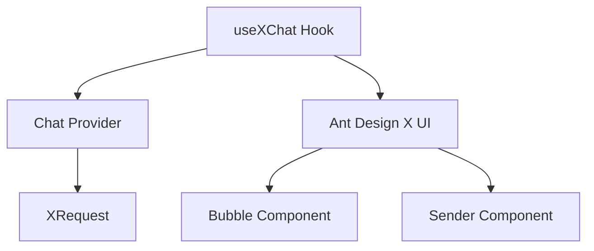

# 🎯 Skill Positioning

> **Core Positioning**: Use the `useXChat` Hook to build professional AI conversation applications **Prerequisites**: Already have a custom Chat Provider (refer to [x-chat-provider skill](../x-chat-provider))

## Table of Contents

- [🚀 Quick Start](#-quick-start)
  - [Dependency Management](#1-dependency-management)
  - [Three-step Integration](#2-three-step-integration)
- [🧩 Core Concepts](#-core-concepts)
  - [Technology Stack Architecture](#technology-stack-architecture)
  - [Data Model](#data-model)
- [🔧 Core Function Details](#-core-function-details)
  - [Message Management](#1-message-management)
  - [Request Control](#2-request-control)
  - [Error Handling](#3-error-handling)
  - [Complete Example Project](#-complete-example-project)
- [📋 Prerequisites and Dependencies](#-prerequisites-and-dependencies)
- [🚨 Development Rules](#-development-rules)
- [🔗 Reference Resources](#-reference-resources)
  - [📚 Core Reference Documentation](#-core-reference-documentation)
  - [🌐 SDK Official Documentation](#-sdk-official-documentation)
  - [💻 Example Code](#-example-code)

# 🚀 Quick Start

## 1. Dependency Management

### 🎯 Automatic Dependency Handling

### 📋 System Requirements

- **@ant-design/x-sdk**: 2.2.2+ (automatically installed)
- **@ant-design/x**: latest version (UI components, automatically installed)

### ⚠️ Version Issue Auto-fix

If version mismatch is detected, the skill will automatically:

- ✅ Prompt current version status
- ✅ Provide fix suggestions
- ✅ Use relative paths to ensure compatibility

#### 🎯 Built-in Version Check

The use-x-chat skill has built-in version checking functionality, automatically checking version compatibility on startup:

**🔍 Auto-check Function** The skill will automatically check if the `@ant-design/x-sdk` version meets requirements (≥2.2.2) on startup:

**📋 Check Contents:**

- ✅ Currently installed version
- ✅ Whether it meets minimum requirements (≥2.2.2)
- ✅ Automatically provide fix suggestions
- ✅ Friendly error prompts

**🛠️ Version Issue Fix** If version mismatch is detected, the skill will provide specific fix commands:

```bash
# Auto-prompted fix commands
npm install @ant-design/x-sdk@^2.2.2

# Or install latest version
npm install @ant-design/x-sdk@latest
```

## 2. Three-step Integration

### Step 1: Prepare Provider

This part is handled by the x-chat-provider skill

```ts
import { MyChatProvider } from './MyChatProvider';
import { XRequest } from '@ant-design/x-sdk';

// Recommended to use XRequest as the default request method
const provider = new MyChatProvider({
  // Default use XRequest, no need for custom fetch
  request: XRequest('https://your-api.com/chat'),
  // When requestPlaceholder is set, placeholder message will be displayed before request starts
  requestPlaceholder: {
    content: 'Thinking...',
    role: 'assistant',
    timestamp: Date.now(),
  },
  // When requestFallback is set, fallback message will be displayed when request fails
  requestFallback: (_, { error, errorInfo, messageInfo }) => {
    if (error.name === 'AbortError') {
      return {
        content: messageInfo?.message?.content || 'Reply cancelled',
        role: 'assistant' as const,
        timestamp: Date.now(),
      };
    }
    return {
      content: errorInfo?.error?.message || 'Network error, please try again later',
      role: 'assistant' as const,
      timestamp: Date.now(),
    };
  },
});
```

### Step 2: Basic Usage

```tsx
import { useXChat } from '@ant-design/x-sdk';

const ChatComponent = () => {
  const { messages, onRequest, isRequesting } = useXChat({ provider });

  return (
    <div>
      {messages.map((msg) => (
        <div key={msg.id}>
          {msg.message.role}: {msg.message.content}
        </div>
      ))}
      <button onClick={() => onRequest({ query: 'Hello' })}>Send</button>
    </div>
  );
};
```

### Step 3: UI Integration

```tsx
import { Bubble, Sender } from '@ant-design/x';

const ChatUI = () => {
  const { messages, onRequest, isRequesting, abort } = useXChat({ provider });

  return (
    <div style={{ height: 600 }}>
      <Bubble.List items={messages} />
      <Sender
        loading={isRequesting}
        onSubmit={(content) => onRequest({ query: content })}
        onCancel={abort}
      />
    </div>
  );
};
```

# 🧩 Core Concepts

## Technology Stack Architecture



### Data Model

> ⚠️ **Important Reminder**: `messages` type is `MessageInfo<MessageType>[]`, not direct `MessageType`

```ts
interface MessageInfo<Message> {
  id: number | string; // Message unique identifier
  message: Message; // Actual message content
  status: MessageStatus; // Sending status
  extraInfo?: AnyObject; // Extended information
}

// Message status enum
type MessageStatus = 'local' | 'loading' | 'updating' | 'success' | 'error' | 'abort';
```

# 🔧 Core Function Details

> 💡 **Tip**: API may update with versions, it is recommended to check [official documentation](https://github.com/ant-design/x/blob/main/packages/x/docs/x-sdk/use-x-chat.en-US.md) for the latest information

Core functionality reference content [CORE.md](reference/CORE.md)

# 📋 Prerequisites and Dependencies

## ⚠️ Important Dependencies

**use-x-chat must depend on one of the following skills:**

| Dependency Type | Skill | Description | Required |
| --- | --- | --- | --- |
| **Core Dependency** | **x-chat-provider** | Provides custom Provider instance, default uses XRequest, **must** be used with use-x-chat | **Required** |
| **Or** | **Built-in Provider** | OpenAI/DeepSeek and other built-in Providers, default uses XRequest | **Required** |
| **Recommended Dependency** | **x-request** | Configure request parameters and authentication, as the default request method | **Recommended** |

## 🎯 Usage Scenario Comparison Table

| Usage Scenario | Required Skill Combination | Usage Order |
| --- | --- | --- |
| **Private API Adaptation** | x-chat-provider → use-x-chat | Create Provider first, then use |
| **Standard API Usage** | use-x-chat (built-in Provider) | Direct use |
| **Authentication Configuration Needed** | x-request → use-x-chat | Configure request first, then use |
| **Complete Customization** | x-chat-provider → x-request → use-x-chat | Complete workflow |

# 🚨 Development Rules

## Before using use-x-chat, must confirm:

- [ ] **Has Provider source** (choose one of the following):
  - [ ] Has created custom Provider with **x-chat-provider**
  - [ ] Decided to use built-in Provider (OpenAI/DeepSeek)
- [ ] @ant-design/x-sdk is installed
- [ ] Understand MessageInfo data structure
- [ ] UI components are ready

### Test Case Rules

- **If the user does not explicitly need test cases, do not add test files**
- **Only create test cases when the user explicitly requests them**

### Code Quality Rules

- **After completion, must check types**: Run `tsc --noEmit` to ensure no type errors
- **Keep code clean**: Remove all unused variables and imports

# 🔗 Reference Resources

## 📚 Core Reference Documentation

- [API.md](reference/API.md) - Complete API reference documentation
- [EXAMPLES.md](reference/EXAMPLES.md) - All practical example code

## 🌐 SDK Official Documentation

- [useXChat Official Documentation](https://github.com/ant-design/x/blob/main/packages/x/docs/x-sdk/use-x-chat.en-US.md)
- [XRequest Official Documentation](https://github.com/ant-design/x/blob/main/packages/x/docs/x-sdk/x-request.en-US.md)
- [Chat Provider Official Documentation](https://github.com/ant-design/x/blob/main/packages/x/docs/x-sdk/chat-provider.en-US.md)

## 💻 Example Code

- [custom-provider-width-ui.tsx](https://github.com/ant-design/x/blob/main/packages/x/docs/x-sdk/demos/chat-providers/custom-provider-width-ui.tsx) - Complete example of custom Provider
