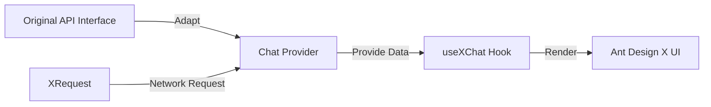
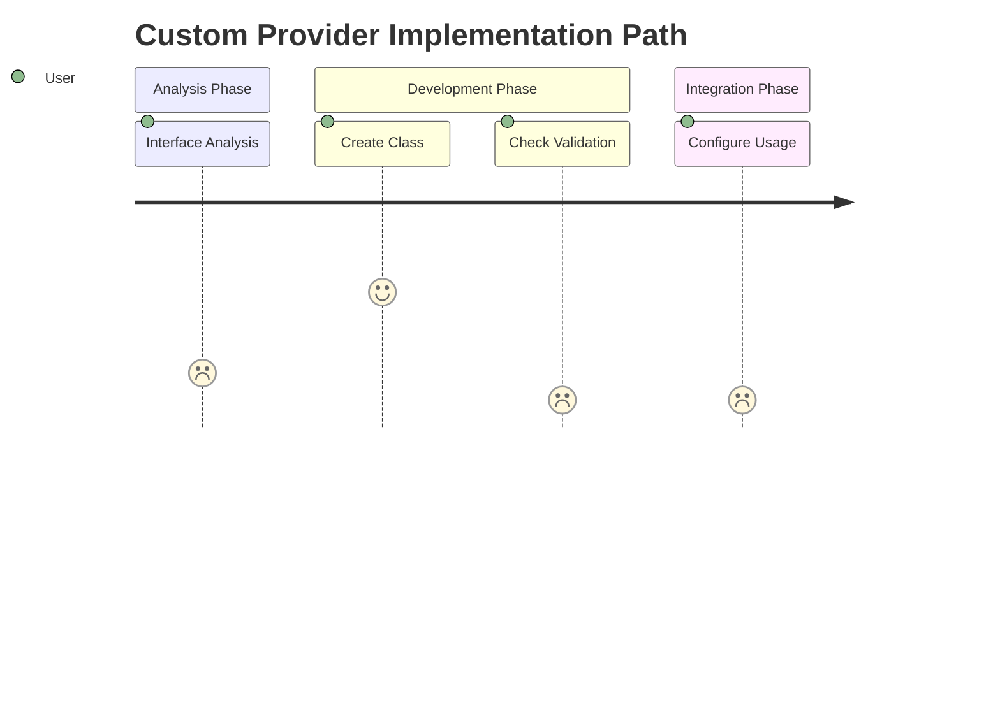
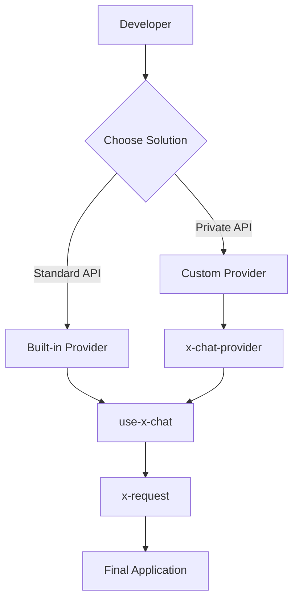
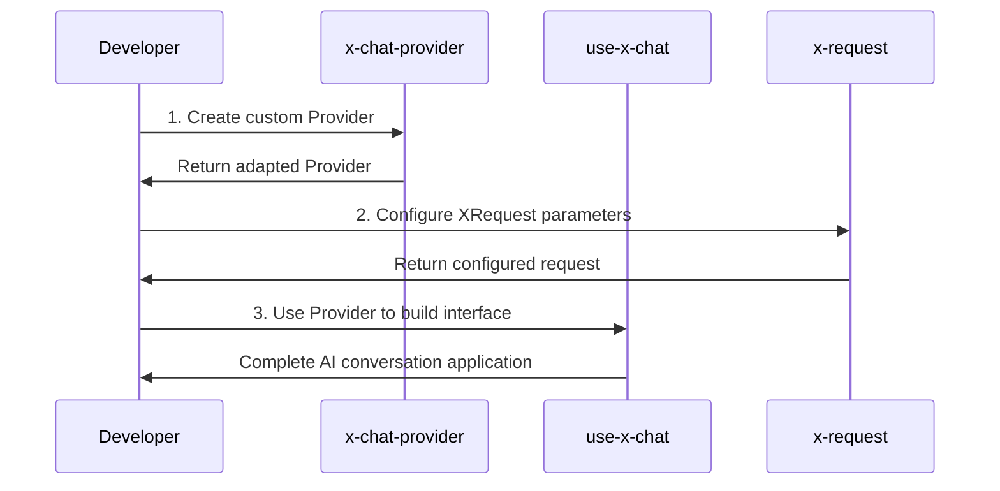
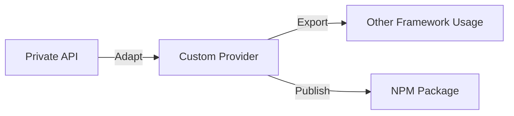

# 🎯 Skill Positioning

**This skill focuses on solving one problem**: How to quickly adapt your streaming interface to Ant Design X's Chat Provider.

**Not involved**: useXChat usage tutorial (that's another skill).

## Table of Contents

- [📦 Technology Stack Overview](#-technology-stack-overview)
  - [Ant Design X Ecosystem](#ant-design-x-ecosystem)
  - [Core Concepts](#core-concepts)
- [🚀 Quick Start](#-quick-start)
  - [Dependency Management](#dependency-management)
  - [Built-in Provider](#built-in-provider)
  - [When to Use Custom Provider](#when-to-use-custom-provider)
- [📋 Four Steps to Implement Custom Provider](#-four-steps-to-implement-custom-provider)
  - [Step1: Analyze Interface Format](#step1-analyze-interface-format)
  - [Step2: Create Provider Class](#step2-create-provider-class)
  - [Step3: Check Files](#step3-check-files)
  - [Step4: Use Provider](#step4-use-provider)
- [🔧 Common Scenario Adaptation](#-common-scenario-adaptation)
- [📋 Joint Skill Usage](#-joint-skill-usage)
  - [Scenario1: Complete AI Conversation Application](#scenario1-complete-ai-conversation-application)
  - [Scenario2: Only Create Provider](#scenario2-only-create-provider)
  - [Scenario3: Use Built-in Provider](#scenario3-use-built-in-provider)
- [⚠️ Important Reminders](#️-important-reminders)
  - [Mandatory Rule: Prohibit Writing request Method](#mandatory-rule-prohibit-writing-request-method)
- [⚡ Quick Checklist](#-quick-checklist)
- [🚨 Development Rules](#-development-rules)
- [🔗 Reference Resources](#-reference-resources)
  - [📚 Core Reference Documentation](#-core-reference-documentation)
  - [🌐 SDK Official Documentation](#-sdk-official-documentation)
  - [💻 Example Code](#-example-code)

# 📦 Technology Stack Overview

### 🏗️ Ant Design X Ecosystem Architecture

| Layer | Package Name | Core Purpose | Typical Usage Scenarios |
| --- | --- | --- | --- |
| **UI Layer** | **@ant-design/x** | React UI component library | Build chat interfaces, bubbles, input boxes |
| **Logic Layer** | **@ant-design/x-sdk** | Development toolkit | Data flow management, Provider, Hook |
| **Render Layer** | **@ant-design/x-markdown** | Markdown renderer | Content display, code highlighting |

> ⚠️ **Important Reminder**: These three packages have different functional positioning, please import required features from the correct package
>
> ```ts
> // ✅ Correct import examples
> import { Bubble } from '@ant-design/x'; // UI component
> import { AbstractChatProvider } from '@ant-design/x-sdk'; // Provider base class
> import { XRequest } from '@ant-design/x-sdk'; // Request tool
> ```

### 🔑 Core Concept Analysis



| Concept | Role Positioning | Core Responsibility | Usage Scenario |
| --- | --- | --- | --- |
| **Chat Provider** | 🔄 Data Adapter | Convert any interface format to Ant Design X standard format | Private API adaptation, format conversion |
| **useXChat** | ⚛️ React Hook | Manage conversation state, message flow, request control | Build AI conversation interface |
| **XRequest** | 🌐 Request Tool | Handle all network communication, authentication, error handling | Unified request management |

# 🚀 Quick Start

### 📋 Environment Preparation

#### System Requirements

| Package | Version Requirement | Auto Install | Purpose |
| --- | --- | --- | --- |
| **@ant-design/x-sdk** | ≥2.2.2 | ✅ | Core SDK, includes Provider and Hook |
| **@ant-design/x** | Latest version | ✅ | UI component library, build chat interface |

#### 🛠️ One-click Environment Check

```bash
# Auto check and fix version
npm ls @ant-design/x-sdk
# If version doesn't match, auto prompt:
npm install @ant-design/x-sdk@latest
```

#### 📊 Version Compatibility Matrix

| SDK Version | Supported Features          | Compatibility            |
| ----------- | --------------------------- | ------------------------ |
| ≥2.2.2      | Full Provider functionality | ✅ Recommended           |
| 2.2.0       | Basic functionality         | ⚠️ Partial compatibility |
| <2.2.0      | Not supported               | ❌ Need upgrade          |

### 🎯 Provider Selection Decision Tree


### 🏭 Built-in Provider Overview

#### Out-of-the-box Providers

| Provider Type         | Applicable Scenario   | Usage Method      |
| --------------------- | --------------------- | ----------------- |
| **OpenAI Provider**   | Standard OpenAI API   | Direct import use |
| **DeepSeek Provider** | Standard DeepSeek API | Direct import use |

#### Quick Decision Guide

| Scenario                     | Recommended Solution       | Example                      |
| ---------------------------- | -------------------------- | ---------------------------- |
| Call official OpenAI         | Built-in OpenAI Provider   | `new OpenAIProvider()`       |
| Call official DeepSeek       | Built-in DeepSeek Provider | `new DeepSeekProvider()`     |
| Company internal API         | Custom Provider            | See four-step implementation |
| Third-party non-standard API | Custom Provider            | See four-step implementation |

# 📋 Four Steps to Implement Custom Provider

## 🎯 Implementation Path Overview



## Step1: Analyze Interface Format ⏱️ 2 minutes

### 📋 Interface Information Collection Table

| Information Type          | Example Value               | Your Interface  |
| ------------------------- | --------------------------- | --------------- |
| **Interface URL**         | `https://your-api.com/chat` | `_____________` |
| **Request Method**        | POST                        | `_____________` |
| **Request Format**        | JSON                        | `_____________` |
| **Response Format**       | Server-Sent Events          | `_____________` |
| **Authentication Method** | Bearer Token                | `_____________` |

### 🔍 Interface Format Template

#### ✅ Request Format Example

```ts
// Your actual request format
interface MyAPIRequest {
  query: string; // User question
  context?: string; // Conversation history (optional)
  model?: string; // Model selection (optional)
  stream?: boolean; // Whether streaming (optional)
}
```

#### ✅ Response Format Example

```ts
// Streaming response format
// Actual response: data: {"content": "answer content"}
interface MyAPIResponse {
  content: string; // Answer fragment
  finish_reason?: string; // End marker
}

// End marker: data: [DONE]
```

## Step2: Create Provider Class ⏱️ 5 minutes

### 🏗️ Code Template (Copy and Use)

```ts
// MyChatProvider.ts
import { AbstractChatProvider } from '@ant-design/x-sdk';

// ====== 1st modification: Define your interface types ======
interface MyInput {
  query: string;
  context?: string;
  model?: string;
  stream?: boolean;
}

interface MyOutput {
  content: string;
  finish_reason?: string;
}

interface MyMessage {
  content: string;
  role: 'user' | 'assistant';
  timestamp: number;
}

// ====== 2nd modification: Modify class name ======
export class MyChatProvider extends AbstractChatProvider<MyMessage, MyInput, MyOutput> {
  // Parameter conversion: convert useXChat parameters to your API parameters
  transformParams(
    requestParams: Partial<MyInput>,
    options: XRequestOptions<MyInput, MyOutput, MyMessage>,
  ): MyInput {
    if (typeof requestParams !== 'object') {
      throw new Error('requestParams must be an object');
    }

    return {
      query: requestParams.query || '',
      context: requestParams.context,
      model: 'gpt-3.5-turbo', // Adjust according to your API
      stream: true,
      ...(options?.params || {}),
    };
  }

  // Local message: user sent message format
  transformLocalMessage(requestParams: Partial<MyInput>): MyMessage {
    return {
      content: requestParams.query || '',
      role: 'user',
      timestamp: Date.now(),
    };
  }

  // ====== 3rd modification: Response data conversion ======
  transformMessage(info: { originMessage: MyMessage; chunk: MyOutput }): MyMessage {
    const { originMessage, chunk } = info;

    // Handle end marker
    if (!chunk?.content || chunk.content === '[DONE]') {
      return { ...originMessage, status: 'success' as const };
    }

    // Accumulate response content
    return {
      ...originMessage,
      content: `${originMessage.content || ''}${chunk.content || ''}`,
      role: 'assistant' as const,
      status: 'loading' as const,
    };
  }
}
```

### 🚨 Development Notes

- ✅ **Only change 3 places**: interface types, class name, response conversion logic
- ✅ **Prohibit implementing request method**: Network requests handled by XRequest
- ✅ **Maintain type safety**: Use TypeScript strict mode

## Step3: Check Validation ⏱️ 1 minute

### ✅ Quick Checklist

| Check Item             | Status | Description                           |
| ---------------------- | ------ | ------------------------------------- |
| **Correct class name** | ⏳     | `MyChatProvider` → Your class name    |
| **Type matching**      | ⏳     | Interface types match actual API      |
| **Complete methods**   | ⏳     | All 3 methods implemented             |
| **No request method**  | ⏳     | Confirm no request method implemented |
| **Type check passed**  | ⏳     | `tsc --noEmit` no errors              |

### 🔍 Validation Code

```bash
# Run type check
npx tsc --noEmit MyChatProvider.ts

# Expected result: no error output
```

## Step4: Configure Usage ⏱️ 1 minute

### 🔧 Complete Integration Example

```ts
// 1. Import dependencies
import { MyChatProvider } from './MyChatProvider';
import { XRequest } from '@ant-design/x-sdk';

// 2. Configure XRequest (handled by x-request skill)
const request = XRequest('https://your-api.com/chat', {
  // Authentication configuration
  headers: {
    Authorization: 'Bearer your-token-here',
    'Content-Type': 'application/json',
  },

  // Default parameters
  params: {
    model: 'gpt-3.5-turbo',
    max_tokens: 1000,
    temperature: 0.7,
  },

  // Streaming configuration
  manual: true,
});

// 3. Create Provider instance
const provider = new MyChatProvider({
  request, // Must pass XRequest instance
});

// 4. Now can be used with useXChat
// This part is handled by use-x-chat skill
export { provider };
```

### 🎉 Usage Advantages

- **Zero network code**: XRequest handles all network details
- **Type safety**: Complete TypeScript support
- **Easy testing**: Can mock XRequest for unit testing
- **Unified configuration**: Authentication, parameters, error handling centralized management

# 🔧 Common Scenario Adaptation

## 📚 Scenario Adaptation Guide

| Scenario Type | Difficulty | Example Link | Description |
| --- | --- | --- | --- |
| **Standard OpenAI** | 🟢 Simple | [Built-in Provider Example](reference/EXAMPLES.md#scenario1-openai-format) | Direct use of built-in Provider |
| **Standard DeepSeek** | 🟢 Simple | [Built-in Provider Example](reference/EXAMPLES.md#scenario2-deepseek-format) | Direct use of built-in Provider |
| **Private API** | 🟡 Medium | [Custom Provider Details](reference/EXAMPLES.md#scenario3-custom-provider) | Need four-step implementation |

> 📖 **Complete Examples**: [EXAMPLES.md](reference/EXAMPLES.md) contains complete code for all actual scenarios

# 📋 Joint Skill Usage Guide

## 🎯 Skill Relationship Diagram



## 📊 Skill Comparison Table

| Skill Role | Skill Name | Prerequisites | Core Responsibility | Usage Scenario |
| --- | --- | --- | --- | --- |
| **🏗️ Creator** | **x-chat-provider** | None | Create custom Provider | Adapt private/non-standard APIs |
| **⚛️ User** | **use-x-chat** | Needs Provider | Build AI conversation interface | React component development |
| **🔧 Configurer** | **x-request** | None | Configure request parameters authentication | Unified network request management |

## 🎯 Combined Usage Scenarios

### 🚀 Scenario1: Complete AI Conversation Application

**Applicable**: Build complete AI conversation product from scratch



**Implementation Steps**:

1. **x-chat-provider** → Create custom Provider (four-step implementation)
2. **x-request** → Configure authentication, parameters, error handling
3. **use-x-chat** → Build React chat interface

### 🎯 Scenario2: Only Create Provider

**Applicable**: Provide Provider for other frameworks or teams



**Core Value**:

- 🔧 **Decoupling**: Provider separated from UI framework
- 📦 **Reusability**: Can be used by multiple projects
- 🚀 **Efficiency**: Develop once, use everywhere

### ⚡ Scenario3: Use Built-in Provider

**Applicable**: Quick prototype development or standard API calls


**Advantages**:

- ⚡ **Zero Development**: No need for custom Provider
- 🎯 **Zero Configuration**: Built-in best practices
- 🚀 **Ultra-fast Launch**: Complete in 5 minutes

## ⚠️ Important Reminders

### 🚨 Mandatory Rule: Prohibit Writing request Method!

**Mandatory Requirements**:

- 🚫 **Absolutely prohibit** implementing `request` method in Provider
- ✅ **Must use** XRequest to handle all network requests
- ✅ **Only focus** on data conversion logic (transformParams, transformLocalMessage, transformMessage)

**❌ Serious Error (Absolutely Prohibited)**:

```ts
// ❌ Serious error: implement request method yourself
class MyProvider extends AbstractChatProvider {
  async request(params: any) {
    // Prohibit writing network request logic!
    const response = await fetch(this.url, { ... });
    return response;
  }
}
```

**✅ Mandatory Requirement (Only Correct Way)**:

```ts
// ✅ Mandatory requirement: use XRequest, prohibit implementing request method
class MyProvider extends AbstractChatProvider {
  // Prohibit implementing request method!
  transformParams(params) {
    /* ... */
  }
  transformLocalMessage(params) {
    /* ... */
  }
  transformMessage(info) {
    /* ... */
  }
}

// Mandatory use of XRequest:
const provider = new MyProvider({
  request: XRequest('https://your-api.com/chat'),
});
```

# ⚡ Quick Checklist

Before creating Provider, confirm:

- [ ] Interface documentation obtained
- [ ] Request/response format confirmed
- [ ] Message structure defined
- [ ] Interface availability tested
- [ ] **Decided to use XRequest** (avoid writing request method yourself!)

After completion:

- [ ] Provider class can be instantiated normally
- [ ] **Only implemented three required methods** (transformParams, transformLocalMessage, transformMessage)
- [ ] **Absolutely prohibit implementing request method** (mandatory use XRequest for network requests)
- [ ] Edge cases handled (empty data, error responses)
- [ ] **Type check passed** (ensure all TypeScript types are correct)
- [ ] **Remove unused exports** (clean up unused export items)

# 🚨 Development Rules

## Test Case Rules

- **If the user does not explicitly need test cases, do not add test files**
- **Only create test cases when the user explicitly requests them**

## Code Quality Rules

- **After completion, must check types**: Run `tsc --noEmit` to ensure no type errors
- **Keep code clean**: Remove all unused variables and imports

# 🔗 Reference Resources

## 📚 Core Reference Documentation

- [EXAMPLES.md](reference/EXAMPLES.md) - Practical example code

## 🌐 SDK Official Documentation

- [useXChat Official Documentation](https://github.com/ant-design/x/blob/main/packages/x/docs/x-sdk/use-x-chat.en-US.md)
- [XRequest Official Documentation](https://github.com/ant-design/x/blob/main/packages/x/docs/x-sdk/x-request.en-US.md)
- [Chat Provider Official Documentation](https://github.com/ant-design/x/blob/main/packages/x/docs/x-sdk/chat-provider.en-US.md)

## 💻 Example Code

- [custom-provider-width-ui.tsx](https://github.com/ant-design/x/blob/main/packages/x/docs/x-sdk/demos/chat-providers/custom-provider-width-ui.tsx) - Complete example of custom Provider
