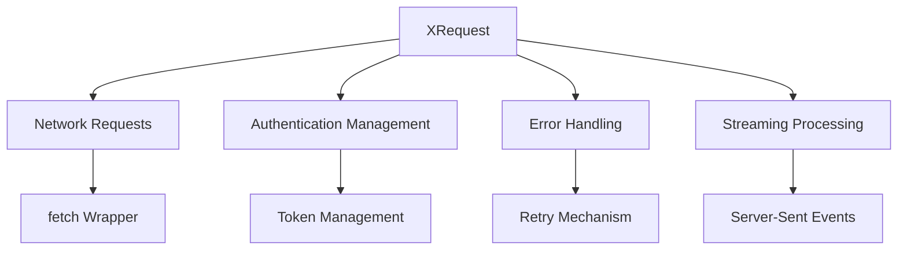
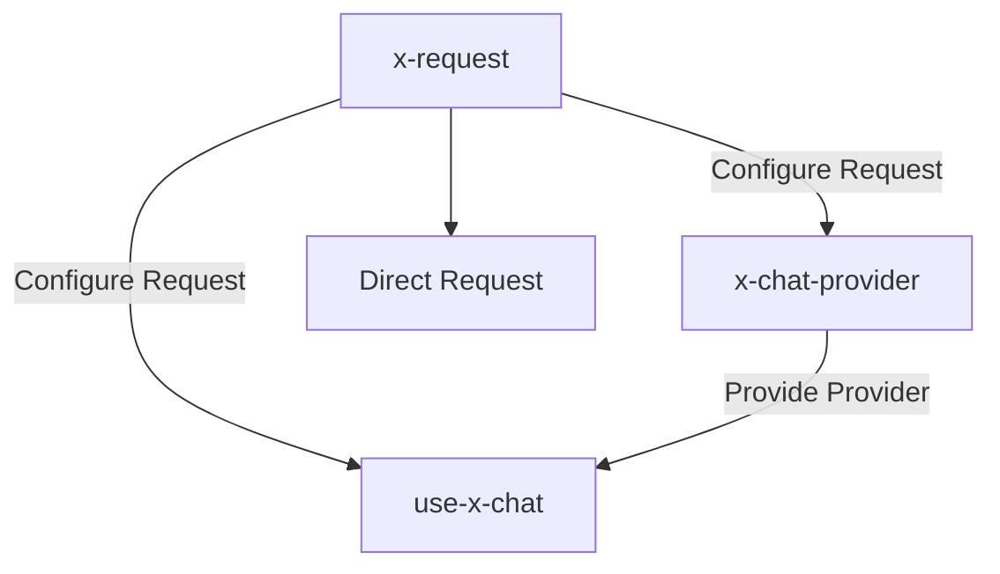
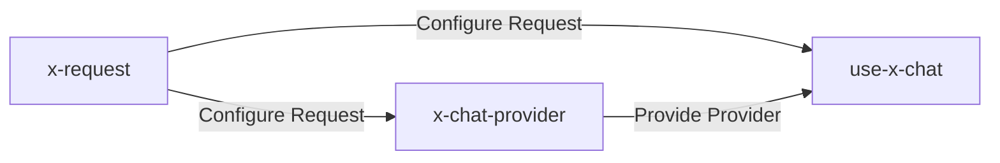

# 🎯 Skill Positioning

**This skill focuses on solving**: How to correctly configure XRequest to adapt to various streaming interface requirements.

# Table of Contents

- [🚀 Quick Start](#-quick-start) - Get started in 3 minutes
  - [Dependency Management](#dependency-management)
  - [Basic Configuration](#basic-configuration)
- [📦 Technology Stack Overview](#-technology-stack-overview)
- [🔧 Core Configuration Details](#-core-configuration-details)
  - [Global Configuration](#1-global-configuration)
  - [Security Configuration](#2-security-configuration)
  - [Streaming Configuration](#3-streaming-configuration)
- [🛡️ Security Guide](#️-security-guide)
  - [Environment Security Configuration](#environment-security-configuration)
  - [Authentication Methods Comparison](#authentication-methods-comparison)
- [🔍 Debugging and Testing](#-debugging-and-testing)
  - [Debug Configuration](#debug-configuration)
  - [Configuration Validation](#configuration-validation)
- [📋 Usage Scenarios](#-usage-scenarios)
  - [Standalone Usage](#standalone-usage)
  - [Integration with Other Skills](#integration-with-other-skills)
- [🚨 Development Rules](#-development-rules)
- [🔗 Reference Resources](#-reference-resources)
  - [📚 Core Reference Documentation](#-core-reference-documentation)
  - [🌐 SDK Official Documentation](#-sdk-official-documentation)
  - [💻 Example Code](#-example-code)

# 🚀 Quick Start

## Dependency Management

### 📋 System Requirements

| Package               | Version Requirement | Auto Install | Purpose                          |
| --------------------- | ------------------- | ------------ | -------------------------------- |
| **@ant-design/x-sdk** | ≥2.2.2              | ✅           | Core SDK, includes XRequest tool |

### 🛠️ One-click Installation

```bash
# Recommended to use tnpm
tnpm install @ant-design/x-sdk

# Or use npm
npm add @ant-design/x-sdk

# Check version
npm ls @ant-design/x-sdk
```

## Basic Configuration

### Simplest Usage

```typescript
import { XRequest } from '@ant-design/x-sdk';

// Minimal configuration: only need to provide API URL
const request = XRequest('https://api.example.com/chat');

// For manual control (used in Provider scenarios)
const providerRequest = XRequest('https://api.example.com/chat', {
  manual: true, // Usually only this needs explicit configuration
});
```

> 💡 **Tip**: XRequest has built-in reasonable default configurations. In most cases, you only need to provide the API URL to use it.

# 📦 Technology Stack Overview

## 🏗️ Technology Stack Architecture



## 🔑 Core Concepts

| Concept | Role Positioning | Core Responsibilities | Usage Scenarios |
| --- | --- | --- | --- |
| **XRequest** | 🌐 Request Tool | Handle all network communication, authentication, error handling | Unified request management |
| **Global Config** | ⚙️ Config Center | Configure once, use everywhere | Reduce duplicate code |
| **Streaming Config** | 🔄 Streaming Processing | Support SSE and JSON response formats | AI conversation scenarios |

# 🔧 Core Configuration Details

Core functionality reference content [CORE.md](reference/CORE.md)

# 🛡️ Security Guide

## Environment Security Configuration

### 🌍 Security Strategies for Different Environments

| Runtime Environment | Security Level | Configuration Method | Risk Description |
| --- | --- | --- | --- |
| **Browser Frontend** | 🔴 High Risk | ❌ Prohibit key configuration | Keys will be directly exposed to users |
| **Node.js Backend** | 🟢 Safe | ✅ Environment variable configuration | Keys stored on server side |
| **Proxy Service** | 🟢 Safe | ✅ Same-origin proxy forwarding | Keys managed by proxy service |

### 🔐 Authentication Methods Comparison

| Authentication Method | Applicable Environment | Configuration Example | Security |
| --- | --- | --- | --- |
| **Bearer Token** | Node.js | `Bearer ${process.env.API_KEY}` | ✅ Safe |
| **API Key Header** | Node.js | `X-API-Key: ${process.env.KEY}` | ✅ Safe |
| **Proxy Forwarding** | Browser | `/api/proxy/service` | ✅ Safe |
| **Direct Configuration** | Browser | `Bearer sk-xxx` | ❌ Dangerous |

# 🔍 Debugging and Testing

## Debug Configuration

### 🛠️ Debug Templates

**Node.js Debug Configuration**:

```typescript
// Safe debug configuration (Node.js environment)
const debugRequest = XRequest('https://your-api.com/chat', {
  headers: {
    Authorization: `Bearer ${process.env.DEBUG_API_KEY}`,
  },
  params: { query: 'test message' },
});
```

**Frontend Debug Configuration**:

```typescript
// Safe debug configuration (frontend environment)
const debugRequest = XRequest('/api/debug/chat', {
  params: { query: 'test message' },
});
```

## Configuration Validation

### ✅ Security Check Tools

```typescript
// Security configuration validation function
const validateSecurity = (config: any) => {
  const isBrowser = typeof window !== 'undefined';
  const hasAuth = config.headers?.Authorization || config.headers?.authorization;

  if (isBrowser && hasAuth) {
    throw new Error(
      '❌ Frontend environment prohibits Authorization configuration, risk of key leakage!',
    );
  }

  console.log('✅ Security configuration check passed');
  return true;
};

// Usage example
validateSecurity({
  headers: {
    // Do not include Authorization
  },
});
```

# 📋 Usage Scenarios

## Standalone Usage

### 🎯 Direct Request Initiation

```typescript
import { XRequest } from '@ant-design/x-sdk';

// Test interface availability
const testRequest = XRequest('https://httpbin.org/post', {
  params: { test: 'data' },
});

// Send request immediately
const response = await testRequest();
console.log(response);
```

## Integration with Other Skills

### 🔄 Skill Collaboration Workflow



| Usage Method | Cooperating Skill | Purpose | Example |
| --- | --- | --- | --- |
| **Standalone** | None | Direct network request initiation | Test interface availability |
| **With x-chat-provider** | x-chat-provider | Configure requests for custom Provider | Configure private API |
| **With use-x-chat** | use-x-chat | Configure requests for built-in Provider | Configure OpenAI API |
| **Complete AI Application** | x-request → x-chat-provider → use-x-chat | Configure requests for entire system | Complete AI conversation application |

### ⚠️ useXChat Integration Security Warning

**Important Warning: useXChat is only for frontend environments, XRequest configuration must not contain Authorization!**

**❌ Incorrect Configuration (Dangerous)**:

```typescript
// Extremely dangerous: keys will be directly exposed to browser
const unsafeRequest = XRequest('https://api.openai.com/v1/chat/completions', {
  headers: {
    Authorization: 'Bearer sk-xxxxxxxxxxxxxx', // ❌ Dangerous!
  },
  manual: true,
});
```

**✅ Correct Configuration (Safe)**:

```typescript
// Frontend security configuration: use proxy service
const safeRequest = XRequest('/api/proxy/openai', {
  params: {
    model: 'gpt-3.5-turbo',
    stream: true,
  },
  manual: true,
});
```

# 🚨 Development Rules

## Test Case Rules

- **If the user does not explicitly need test cases, do not add test files**
- **Only create test cases when the user explicitly requests them**

## Code Quality Rules

- **After completion, must check types**: Run `tsc --noEmit` to ensure no type errors
- **Keep code clean**: Remove all unused variables and imports

## ✅ Configuration Checklist

Before using XRequest, please confirm the following configurations are correctly set:

### 🔍 Configuration Checklist

| Check Item | Status | Description |
| --- | --- | --- |
| **API URL** | ✅ Must Configure | `XRequest('https://api.xxx.com')` |
| **Auth Info** | ⚠️ Environment Related | Frontend❌Prohibited, Node.js✅Available |
| **manual Config** | ✅ Provider Scenario | In Provider needs to be set to `true`, other scenarios need to be set according to actual situation |
| **Other Config** | ❌ No Need to Configure | Built-in reasonable default values |
| **Interface Availability** | ✅ Recommended Test | Verify with debug configuration |

### 🛠️ Quick Verification Script

```typescript
// Check configuration before running
const checkConfig = () => {
  const checks = [
    {
      name: 'Global Configuration',
      test: () => {
        // Check if global configuration has been set
        return true; // Check according to actual situation
      },
    },
    {
      name: 'Security Configuration',
      test: () => validateSecurity(globalConfig),
    },
    {
      name: 'Type Check',
      test: () => {
        // Run tsc --noEmit
        return true;
      },
    },
  ];

  checks.forEach((check) => {
    console.log(`${check.name}: ${check.test() ? '✅' : '❌'}`);
  });
};
```

## 🎯 Skill Collaboration



### 📊 Skill Usage Comparison Table

| Usage Scenario | Required Skills | Usage Order | Completion Time |
| --- | --- | --- | --- |
| **Test Interface** | x-request | Direct Use | 2 minutes |
| **Private API Adaptation** | x-request → x-chat-provider | Configure request first, then create Provider | 10 minutes |
| **Standard AI Application** | x-request → use-x-chat | Configure request first, then build interface | 15 minutes |
| **Complete Customization** | x-request → x-chat-provider → use-x-chat | Complete workflow | 30 minutes |

# 🔗 Reference Resources

## 📚 Core Reference Documentation

- [API.md](reference/API.md) - Complete API reference documentation
- [EXAMPLES_SERVICE_PROVIDER.md](reference/EXAMPLES_SERVICE_PROVIDER.md) - Configuration examples for various service providers

## 🌐 SDK Official Documentation

- [useXChat Official Documentation](https://github.com/ant-design/x/blob/main/packages/x/docs/x-sdk/use-x-chat.md)
- [XRequest Official Documentation](https://github.com/ant-design/x/blob/main/packages/x/docs/x-sdk/x-request.md)
- [Chat Provider Official Documentation](https://github.com/ant-design/x/blob/main/packages/x/docs/x-sdk/chat-provider.md)

## 💻 Example Code

- [custom-provider-width-ui.tsx](https://github.com/ant-design/x/blob/main/packages/x/docs/x-sdk/demos/chat-providers/custom-provider-width-ui.tsx) - Complete example of custom Provider
